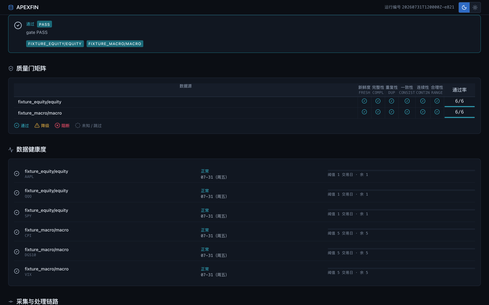
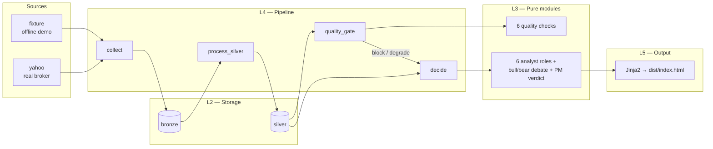

# APEXFIN

> A production-shaped **financial data engineering framework** — five layers,
> a fail-loud quality gate, a six-role analyst debate engine, and an
> offline-reproducible static dashboard. `make demo` runs the whole chain.



[](LICENSE)
[](https://github.com/spakdongg-spec/APEXFIN/actions/workflows/ci.yml)
[](pyproject.toml)
[](#dashboard)
[](#hard-rules)
[](NOTICE)

APEXFIN is the engineering skeleton behind a production multi-role analyst
system, reduced to what you can fork and run in an afternoon. It ships a
five-layer architecture with a hard "dependencies only point downward" rule, a
quality gate that **blocks** the run when a series goes stale, a six-role
analyst framework (technical / macro / options / COT / text / behavioral) that
debates each holding and emits a PM verdict — and a static HTML dashboard that
renders fully offline from a single JSON datapack.

The analyst layer is where the value is. Each role emits a direction, a
confidence and evidence sentences; a bull researcher consolidates the long
case, a bear researcher the short case, and the PM adjudicator weighs
`confidence × role weight` into one verdict: **AFFIRM / MODIFY / REJECT**.
Disagreement is surfaced, not averaged away — the dashboard shows the full
debate for every holding, so the reader sees *why*, not just *what*.

It is **not** an investment tool. The reference implementations exist to make
the framework runnable out of the box; real data sources and alpha are the
fork's job, and the role contract makes that a drop-in.

---

## Why fork this

| Other skeletons | APEXFIN |
|---|---|
| A real-time pipeline that assumes you run Grafana | A pipeline that renders to a *plain HTML file*, openable from `file://` |
| "Connect Postgres and Prometheus" | A committed SQLite file; an offline fixture mode that needs zero credentials |
| One built-in strategy you can't read | Six analyst roles (technical / macro + options / COT / text / behavioral interfaces) feeding a bull/bear debate and a PM verdict, with full evidence text |
| Quality shown as coloured health bars | A six-check gate matrix (freshness / completeness / duplicates / consistency / continuity / range) that **blocks** the run and returns exit 4 on `make demo-stale` |
| "The dashboard is React" | A Jinja2 template + an inline dataclass JSON + an ECharts canvas, vendored locally — no CDN, no build step, no JS framework |

---

## How it works



**The architecture is the product.** Five layers, each layer only importing
downward. The decision engine is intentionally a *framework* — six analyst
roles and a debate engine that surfaces disagreement as `MODIFY` / `no_call`,
not a fabricated average. Replace the `technical` analyst with your own
implementation or wire a real options/CFTC collector into the uncovered roles,
and the debate engine, PM verdict and dashboard pick it up unchanged.

---

## The decision layer: analyst roles + bull/bear debate

The decision layer ports the **analyst-role contract** from APEXDATA (a mature
production system): per-symbol analyst roles emit a direction, a confidence and
evidence sentences; a bull researcher consolidates the long evidence, a bear
researcher the short evidence, and a PM adjudicator weighs
`confidence x role_weight` to emit a single verdict:

- **`AFFIRM`** — bull evidence dominates by >33pp of weighted share
- **`REJECT`** — bear evidence dominates by >33pp
- **`MODIFY`** — evidence is close; the disagreement is stated, not averaged away

Analyst roles shipped (fixture-driven; fork to wire real sources):

| Role | Reads | Ships |
|---|---|---|
| `technical` | own price series | momentum + trend-regime fusion |
| `macro` | VIX / 10Y yield / CPI | risk-on / risk-off regime |
| `options` | — | contract only — reports "not covered" until a real option source is wired |
| `cot` | — | contract only — reports "not covered" until a COT source is wired |
| `text` | — | contract only — reports "not covered" until a news factor is wired |
| `behavioral` | — | contract only — reports "not covered" until a behavioural source is wired |

Every decision on the dashboard shows the **full debate**: each analyst's
stance and evidence, the bull case, the bear case, the rebuttal, risk notes,
and the verdict — so the reader sees the disagreement, not just the outcome.

```text
SPY: 无观点 (no_call)
  MODIFY（多空论据接近(多47% vs 空53%)；信念弱；维度：技术面偏空；宏观流动性偏多）
  [technical] short @46  近 5 日收盘 544.66→534.73，区间收益 -1.82%
  [macro]     long  @46  VIX 16.9 低于 20，波动环境温和
  [options/cot/text/behavioral] 未覆盖（接口形状）
  多头剧本：宏观环境偏风险偏好（risk-on）…
  空头剧本：技术面动量转弱、SMA5 下穿 SMA20…
  反驳：多头反驳：宏观流动性论据占优，但技术面指出真实的反向脆弱点…
```

The role interface is `AnalystView` (direction / confidence / evidence / note)
— the same contract APEXDATA uses — so a fork can drop in a real options or COT
collector and the debate engine, the PM adjudicator and the dashboard all work
unchanged.

---

## Quick start

```bash
git clone https://github.com/spakdongg-spec/APEXFIN.git
cd APEXFIN
make demo        # offline fixture, all 6 sources, gate PASS, exit 0
```

The dashboard is now at `dist/index.html`. Open it directly — it works under
`file://` because `templates/dashboard.html` uses **zero CDN, zero network**.
ECharts and the Lucide icon sprite are vendored locally.

```bash
make demo-stale                         # forced BLOCKED, exit 4
make test && make lint && make typecheck  # verification suite
```

---

## What's actually in the box

| Layer | What ships | Lines |
|---|---|---|
| **L1 core** | Contracts, models, enums, frozen clock, error taxonomy | 6 modules |
| **L2 storage** | SQLite engine, migrations, raw / silver / bronze / health / run / decision repos | 7 modules |
| **L3** | 6 quality checks + analyst roles + debate engine | 16 modules |
| **L4 pipeline** | 7 steps registered via `@step` with `@step` decorator ParameterSpec generics | 8 modules |
| **L5 output** | Typer CLI + Jinja2 render + dataclass `DataPack` + JSON schema | 12 modules |
| **Tests** | 12 tests including 3 regression fixtures for the `demo-stale` contract | 5 files |

```
src/apexfin/
├── core/          # L1 — contracts, models, registry, clock, settings
├── storage/       # L2 — engine, migrator, all repos
├── sources/       # L3 collectors (fixture + yahoo)
├── processing/    # L3 — bronze/silver builders
├── quality/       # L3 — 6 check implementations
├── decision/      # L3 — analysts/ (roles) + debate.py (bull/bear/PM) + orchestrator
├── accounting/    # L3 — opinion ledger
├── pipeline/      # L4 — runner, context, steps, registry, collect
├── reporting/     # L5 — datapack, models, render, builders
└── cli/           # L5 — Typer wiring; composition root
```

Every module is under 300 lines. Every interface uses `Protocol` so a real
analyst can replace a reference without touching the pipeline or the debate
engine.

---

## Hard rules (CI-enforced)

- **Zero emoji** in any rendered surface. Icons are the Lucide SVG sprite
  (`config/icons.yaml` locks the 27 symbols; `config/icons.lock` pins the
  hash per version).
- **No hardcoded colors** outside `static/tokens.css` (except `#fff` / `#000`).
  Every color is a CSS custom property — `--mkt-up`, `--mkt-down`, `--bg`,
  `--surface-2`, etc.
- **State is never color alone** — every status is icon + colour + text per
  WCAG 1.4.1 ("Use of Color"). Market direction (red-up / green-down, CN
  convention) and system status use strictly separated colour channels.
- **No purple→pink gradient**, no glow + glassmorphism, no bounce / elastic
  easing. The dashboard reads as a terminal instrument, not a marketing page.
- **`no_call` is a first-class outcome** — roles that disagree produce
  a documented decision, not a fabricated average (see `debate.py`).

---

## Vendored dependencies

The dashboard is fully offline. `static/vendor/echarts.min.js` ships Apache-2.0
(ECharts 6.1.0); the Lucide sprite is ISC (1.28.0). See [`NOTICE`](NOTICE) for
full attribution.

---

## Demo contract — what CI actually verifies

```bash
make demo        # exit 0, gate PASS
make demo-stale  # exit 4, gate BLOCKED, decide SKIPPED
```

CI runs both on every push. If either silently returns the wrong exit code,
the quality gate is broken — and the dashboard is the only surface that would
show it.

---

## Documentation

- [`docs/SPEC.md`](docs/SPEC.md) — the spec-as-contract, 12 sections, AC-01..AC-11 in EARS format
- [`docs/ARCHITECTURE.md`](docs/ARCHITECTURE.md) — five-layer rules, dependency arrows
- [`docs/INTERFACES.md`](docs/INTERFACES.md) — exact protocols a fork needs to satisfy
- [`docs/CLI_CONTRACT.md`](docs/CLI_CONTRACT.md) — 10 commands, exit codes, --json envelopes
- [`docs/DATA_CONTRACT.md`](docs/DATA_CONTRACT.md) — SQLite schema, JSON schemas, threshold rules
- [`docs/decisions/OPEN-DECISIONS.md`](docs/decisions/OPEN-DECISIONS.md) — what was decided and why

---

## License

MIT. See [`LICENSE`](LICENSE) and [`NOTICE`](NOTICE).
