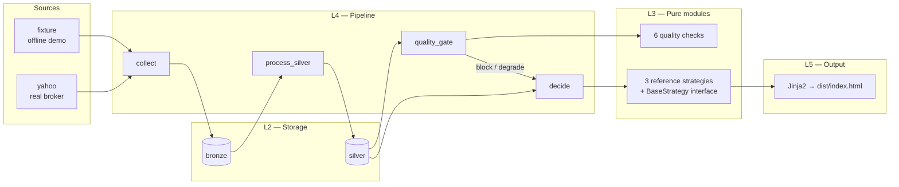

# APEXFIN

> A forkable **financial data engineering reference skeleton** — `make demo` and the
> full pipeline is offline, reproducible, and runs to a static dashboard.


[](LICENSE)
[](pyproject.toml)
[](#dashboard)
[](#hard-rules)
[](NOTICE)

APEXFIN is the project you fork when you want to wire a real data pipeline to a
serious-looking, audit-grade dashboard without spending six months on the
plumbing. It ships a five-layer architecture, a fail-loud quality gate, an
explicitly pluggable decision-engine interface, and a static HTML dashboard
that renders offline from a single JSON datapack.

It is **not** an investment tool. The included decision layer is three
deliberately naive reference strategies wired into an equal-weight aggregator
so the skeleton has the *shape* of a real analysis workflow — multi-strategy
disagreement, per-strategy rationale, macro-aware regime classification — without
shipping anyone's alpha.

---

## Why fork this

| Other skeletons | APEXFIN |
|---|---|
| A real-time data pipeline that ships you to Grafana | A pipeline that ships to a *plain HTML file* you can open from `file://` |
| "Connect Postgres and Prometheus" | A committed SQLite file; offline fixture mode with zero credentials |
| One built-in strategy you can't read | Three reference strategies with full rationale text and an explicit `BaseStrategy` interface to plug your own in |
| Quality "health" coloured bars | A six-check gate matrix (freshness / completeness / duplicates / consistency / continuity / range) that **blocks** the run and returns exit 4 on `make demo-stale` |
| "The dashboard is React" | A Jinja2 template + an inline dataclass JSON + an ECharts canvas, vendored locally — no CDN, no build step, no JS framework |

---

## How it works



**The infrastructure is the project.** Five layers, each layer only importing
downward. The decision engine is intentionally a *shape* — three reference
strategies and an aggregator that surfaces disagreement as `no_call`, not a
fabricated average. Replace `toy_momentum` with your own strategy, register it
via `@register_strategy("your_name")`, and the dashboard picks it up.

---

## The decision layer shape

Three reference strategies, each with a Chinese-narrative rationale wired all
the way to the dashboard:

- **`toy_momentum`** — 5-day close-to-close return on tradeable assets
- **`trend_regime`** — fast/slow SMA regime (`long` above, `short` below, `flat` inside ±0.3% band)
- **`macro_regime`** — reads the macro series (VIX / DGS10 / CPI) and emits a
  risk-on / risk-off stance applied to every tradeable symbol

Equal-weight aggregation. When strategies disagree, the ledger records a
`no_call` decision — a **first-class outcome**, not a silent skip. See
`src/apexfin/decision/aggregator.py` for the rationale.

```text
SPY: 无观点 (no_call)
  3 个信号等权合成，净分 -0.0201；看多（macro_regime）与看空
  （toy_momentum、trend_regime）相互抵消，不形成观点。
    [macro_regime] long  20%  VIX 16.9 低于 20，波动环境温和…
    [toy_momentum]  short 18%  近 5 日收盘 544.66 → 534.73，区间收益 -1.82%…
    [trend_regime]  short  8%  SMA5（543.23）在 SMA20（545.36）下方…
```

This is the **analysis chain** the dashboard exposes per holding. Not a toy
momentum line — three strategies, three reasons, one verdict.

---

## Quick start

```bash
git clone https://github.com/spakdongg-spec/APEXFIN.git
cd APEXFIN
make demo        # offline fixture, all 6 sources, gate PASS, exit 0
```

The dashboard is now at `dist/index.html`. Open it directly — it works under
`file://` because `templates/dashboard.html` uses **zero CDN, zero network**.
ECharts and the Lucide icon sprite are vendored locally.

```bash
make demo-stale                         # forced BLOCKED, exit 4
make test && make lint && make typecheck  # verification suite
```

---

## What's actually in the box

| Layer | What ships | Lines |
|---|---|---|
| **L1 core** | Contracts, models, enums, frozen clock, error taxonomy | 6 modules |
| **L2 storage** | SQLite engine, migrations, raw / silver / bronze / health / run / decision repos | 7 modules |
| **L3** | 6 quality checks + 3 reference strategies + aggregator + base interfaces | 14 modules |
| **L4 pipeline** | 7 steps registered via `@step` with `@step` decorator ParameterSpec generics | 8 modules |
| **L5 output** | Typer CLI + Jinja2 render + dataclass `DataPack` + JSON schema | 12 modules |
| **Tests** | 12 tests including 3 regression fixtures for the `demo-stale` contract | 5 files |

```
src/apexfin/
├── core/          # L1 — contracts, models, registry, clock, settings
├── storage/       # L2 — engine, migrator, all repos
├── sources/       # L3 collectors (fixture + yahoo)
├── processing/    # L3 — bronze/silver builders
├── quality/       # L3 — 6 check implementations
├── decision/      # L3 — base, aggregator, 3 reference strategies
├── accounting/    # L3 — opinion ledger
├── pipeline/      # L4 — runner, context, steps, registry, collect
├── reporting/     # L5 — datapack, models, render, builders
└── cli/           # L5 — Typer wiring; composition root
```

Every module is under 300 lines. Every interface uses `Protocol` so a real
strategy can replace a reference without touching the pipeline.

---

## Hard rules (CI-enforced)

- **Zero emoji** in any rendered surface. Icons are the Lucide SVG sprite
  (`config/icons.yaml` locks the 27 symbols; `config/icons.lock` pins the
  hash per version).
- **No hardcoded colors** outside `static/tokens.css` (except `#fff` / `#000`).
  Every color is a CSS custom property — `--mkt-up`, `--mkt-down`, `--bg`,
  `--surface-2`, etc.
- **State is never color alone** — every status is icon + colour + text per
  WCAG 1.4.1 ("Use of Color"). Market direction (red-up / green-down, CN
  convention) and system status use strictly separated colour channels.
- **No purple→pink gradient**, no glow + glassmorphism, no bounce / elastic
  easing. The board is allowed to look controlled.
- **`no_call` is a first-class outcome** — strategies that disagree produce
  a documented decision, not a fabricated average (see `aggregator.py`).

---

## Vendored dependencies

The dashboard is fully offline. `static/vendor/echarts.min.js` ships Apache-2.0
(ECharts 6.1.0); the Lucide sprite is ISC (1.28.0). See [`NOTICE`](NOTICE) for
full attribution.

---

## Demo contract — the regression test you're really buying

```bash
make demo        # exit 0, gate PASS
make demo-stale  # exit 4, gate BLOCKED, decide SKIPPED
```

Daily CI runs both. If either silently returns the wrong exit code, the
gatekeeper is broken — and the dashboard is the only place you'd see it.

---

## Documentation

- [`docs/SPEC.md`](docs/SPEC.md) — the spec-as-contract, 12 sections, AC-01..AC-11 in EARS format
- [`docs/ARCHITECTURE.md`](docs/ARCHITECTURE.md) — five-layer rules, dependency arrows
- [`docs/INTERFACES.md`](docs/INTERFACES.md) — exact protocols a fork needs to satisfy
- [`docs/CLI_CONTRACT.md`](docs/CLI_CONTRACT.md) — 10 commands, exit codes, --json envelopes
- [`docs/DATA_CONTRACT.md`](docs/DATA_CONTRACT.md) — SQLite schema, JSON schemas, threshold rules
- [`docs/decisions/OPEN-DECISIONS.md`](docs/decisions/OPEN-DECISIONS.md) — what was decided and why

---

## License

MIT. See [`LICENSE`](LICENSE) and [`NOTICE`](NOTICE).
