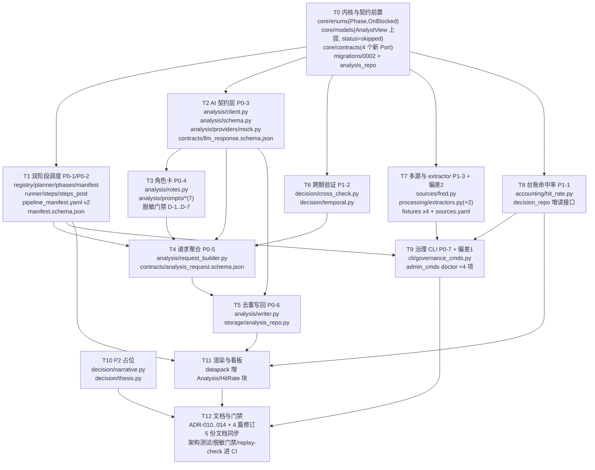

# APEXFIN v0.2 架构增强方案（精细切割 2.0）

| 项目 | 内容 |
|------|------|
| 文档 | v0.2-ARCHITECTURE-ENHANCEMENT.md |
| 版本 | v0.2-draft.1 |
| 撰写 | 高见远（首席架构师） |
| 日期 | 2026-08 |
| 上游输入 | `docs/v0.2-PRD.md`（许清楚）、主理人三决策（Q1-A / Q2-C / Q3-A） |
| 基线文档 | `docs/ARCHITECTURE.md` v1.0、`docs/ALPHA_BOUNDARY.md` v1.0、`docs/INTERFACES.md`、`docs/DATA_CONTRACT.md`、`docs/CLI_CONTRACT.md`、`docs/decisions/ADR-001..009` |
| 现场核验 | APEXDATA `scripts/`（26 py）+ `scripts/pipeline/`（187 py），逐文件确认于本轮 |
| 性质 | 架构方案，不含代码。所有签名为待实现契约 |

本文档不使用 emoji。指向一律用 ASCII `->`。

---

## 零、本方案的一句话

v0.2 不是"加功能"，是**把 v0.1 粗切时连带删掉的三样工程骨架装回去**：

1. **管道的形状**——采集与 POST 分析是两个阶段，不是一条直线（P0-1 / P0-2）；
2. **AI 之前的最后一公里**——请求聚合、契约校验、去重写回，这三步全部是确定性的，AI 只在中间被调用一次（P0-3 / P0-5 / P0-6）；
3. **治理的入口**——治理不是 `run` 的副产品，而是四个可以单独调用、可以进 CI 的命令（P0-7）。

以及三块"让骨架有说服力"的补完：观点对账的显著性检验（P1-1）、跨期验证（P1-2）、多 extractor（P1-3），加一块 P2 占位（叙事/thesis）。

**贯穿全文的一条纪律**：本方案每引入一个数字，都必须回答"它是纪律还是判断"。是纪律 -> 写进代码；是判断 -> 外置到 YAML，或者干脆不提供（`docs/ALPHA_BOUNDARY.md` 一·规则本质）。**附录 A** 逐条列出本方案里所有"看起来像参数"的东西及其处置。

---

## 一、增强总览

### 1.1 模块树变化（v0.1 -> v0.2）

标记：`[+]` 新增文件、`[~]` 修改现有文件、`[!]` 修改且触及 L1 内核（依赖方向敏感）、`[=]` 不变但语义被引用。

```
APEXFIN/
├── config/
│   ├── pipeline_manifest.yaml            [~] 增 phase / frequency / on_blocked；步骤 5 -> 12
│   ├── sources.yaml                      [~] 增 fred / fixture_positioning / fixture_options
│   ├── expectations.yaml                 [~] 增上述三源的 max_lag_trading_days
│   └── calendars/nyse.yaml               [=]
│
├── contracts/
│   ├── manifest.schema.json              [~] version 2；新增 phase/frequency/on_blocked 定义
│   ├── analysis_request.schema.json      [+] AI 研判请求的机器可读契约（P0-5 产物）
│   ├── llm_response.schema.json          [+] LLM 结构化输出契约（P0-3 校验依据）
│   ├── sources.schema.json               [~] 增 min_refresh_interval_days
│   ├── expectations.schema.json          [=]
│   ├── silver_point.schema.json          [=]
│   └── datapack.schema.json              [~] 增 analysis / hit_rate 区块（渲染侧，见 6.4）
│
├── src/apexfin/
│   ├── core/                             L1
│   │   ├── enums.py                      [!] 增 Phase / OnBlocked；Frequency 已存在，改为 manifest 复用
│   │   ├── models.py                     [!] 增 AnalystView（自 decision 上提）；CollectResult.status 增 "skipped"
│   │   ├── contracts.py                  [!] 增 QualityReadPort / DecisionReadPort / LedgerReadPort / AnalysisWritePort
│   │   ├── catalog.py                    [=]
│   │   ├── clock.py / trading_calendar.py / config.py / registry.py / schema.py / errors.py / ids.py / logging.py  [=]
│   │
│   ├── storage/                          L2
│   │   ├── migrations/0002_analysis_and_cadence.sql   [+] llm_analyses / llm_assertions 两表 + 索引
│   │   ├── analysis_repo.py              [+] AnalysisWritePort 实现（一日一角色一分析）
│   │   ├── decision_repo.py              [~] 增 settled_entries / all_entries / recent_decisions
│   │   ├── quality_repo.py               [~] 增 findings_between / health_snapshot（audit 命令用）
│   │   └── engine.py / migrator.py / bronze_repo.py / silver_repo.py / run_repo.py   [=]
│   │
│   ├── sources/                          L3
│   │   ├── fred.py                       [+] 补齐 ARCHITECTURE 3 章声称存在的源（偏差 2）
│   │   ├── fixtures/fresh/fixture_positioning.json   [+]
│   │   ├── fixtures/fresh/fixture_options.json       [+]
│   │   ├── fixtures/stale/fixture_positioning.json   [+]
│   │   ├── fixtures/stale/fixture_options.json       [+]
│   │   └── base.py / fixture.py / yahoo.py           [=]（base 增 "skipped" 语义分支）
│   │
│   ├── processing/                       L3
│   │   ├── extractors.py                 [~] 增 PositioningExtractor / OptionChainExtractor（2 -> 4 范例）
│   │   └── silver_builder.py / quality_score.py      [=]
│   │
│   ├── quality/                          L3
│   │   └── （6 个 check_* + gate + health + base + expectations）  [=] 数量不变（Q1 决策）
│   │
│   ├── decision/                         L3
│   │   ├── cross_check.py                [+] P1-2 多信号互证（纯函数，零 IO）
│   │   ├── temporal.py                   [+] P1-2 跨周期一致性（纯函数，零 IO）
│   │   ├── narrative.py                  [+] P2-1 叙事 schema + registry（占位）
│   │   ├── thesis.py                     [+] P2-1 thesis 骨架（占位）
│   │   ├── analysts/contracts.py         [~] AnalystView 上提 core 后，本文件降为薄再导出层
│   │   ├── analysts/{technical,macro,uncovered}.py   [=]
│   │   └── base.py / views.py / debate.py / orchestrate.py           [=]
│   │
│   ├── analysis/                         L3（v0.1 未落地，v0.2 从零建包）
│   │   ├── __init__.py                   [+]
│   │   ├── client.py                     [+] LLMClient Protocol + Prompt + LLMResponse
│   │   ├── schema.py                     [+] LLMVerdict / Assertion / Evidence + 契约校验 V1-V7
│   │   ├── roles.py                      [+] RoleCard 加载、渲染、脱敏门禁
│   │   ├── request_builder.py            [+] P0-5 确定性聚合 -> AnalysisRequest
│   │   ├── writer.py                     [+] P0-6 一日一分析去重写回
│   │   ├── providers/__init__.py         [+]
│   │   ├── providers/mock.py             [+] MockLLMClient（确定性，Q3 决策）
│   │   └── prompts/                      [+] README + 4 active + 2 placeholder（Q2 决策）
│   │       ├── README.md  technical.md  macro.md  options.md  cot.md
│   │       └── bull.md（placeholder）  bear.md（placeholder）
│   │
│   ├── accounting/                       L3
│   │   ├── hit_rate.py                   [+] P1-1 多 horizon 分桶 + 纯 stdlib 显著性检验
│   │   ├── ledger.py                     [=]
│   │   └── settlement.py                 [=]（命名偏差见 7.4）
│   │
│   ├── pipeline/                         L4
│   │   ├── phases.py                     [+] 阶段闸门：collect 全通过且 gate 裁决后才放行 post
│   │   ├── steps_post.py                 [+] POST 组步骤（拆分以守 300 行）
│   │   ├── planner.py                    [~] 增 phase / frequency 过滤 + cadence 断言
│   │   ├── manifest.py                   [~] 四条断言扩到七条
│   │   ├── registry.py                   [~] Step 增 phase / frequency / on_blocked
│   │   ├── runner.py                     [~] 阶段边界 + on_blocked 统一裁决（取代步骤内 if）
│   │   ├── steps.py                      [~] 只保留 collect 组三步；decide 迁往 steps_post
│   │   └── collect.py / context.py / events.py    [~] context 增 analysis 仓储句柄
│   │
│   ├── reporting/                        L5
│   │   ├── datapack.py                   [~] 增 AnalysisBlock / HitRateBlock 视图模型
│   │   └── builders.py / models.py / charts.py / run_view.py / state_maps.py   [~] 同上牵连
│   │
│   └── cli/                              L5
│       ├── governance_cmds.py            [+] P0-7 freshness / audit / replay
│       ├── analysis_cmds.py              [+] apexfin analyze（手工触发 AI 契约链，可选）
│       ├── admin_cmds.py                 [~] doctor 增 4 项检查（偏差 1 校正）
│       ├── app.py                        [~] 只加注册行（守 300 行，见 6.5）
│       └── context.py / pipeline_cmds.py / state.py    [~]
│
└── docs/
    ├── decisions/ADR-010-analysis-layer-contract.md        [+]
    ├── decisions/ADR-011-two-phase-pipeline.md             [+]
    ├── decisions/ADR-012-deterministic-mock-llm.md         [+]
    ├── decisions/ADR-013-opinion-accounting-significance.md[+]
    ├── decisions/ADR-014-role-card-desensitization.md      [+]
    ├── decisions/ADR-005-alpha-boundary.md                 [~] 追加 v0.2 增量切割记录
    ├── decisions/ADR-004-plugin-mechanism.md               [~] 增 apexfin.llm_providers 组
    ├── ARCHITECTURE.md                                     [~] 三/六/十三章
    ├── ALPHA_BOUNDARY.md                                   [~] 五章规模对照表 + 三章 SKELETONIZE 增补
    ├── DATA_CONTRACT.md                                    [~] 增两表
    ├── CLI_CONTRACT.md                                     [~] 增三命令
    └── INTERFACES.md                                       [~] 增七个 Protocol
```

规模影响：v0.1 实测 `src/apexfin/**/*.py` 为 61 个；v0.2 新增 15 个 py（analysis 8、decision 4、accounting 1、pipeline 2、sources 1、storage 1、cli 2，去重后 15 个左右），合计约 76 个。**这会与 `ALPHA_BOUNDARY.md` 五章"约 60 个"的承诺不符**，必须在该表补一行 v0.2 目标值，否则文档自相矛盾（风险 R-J）。

### 1.2 分层与阶段的关系（一张图看懂 v0.2 的形状）

```
                     +---------------------------------------------+
   L5 cli/reporting  |  run / collect / process / quality / decide  |
                     |  render / manifest / plugins / doctor        |
                     |  freshness / audit / replay / analyze  [新]  |
                     +----------------------+----------------------+
                                            | 只向下
                     +----------------------v----------------------+
   L4 pipeline/      |  manifest(7 断言) -> planner(phase+cadence)  |
                     |  -> phases(阶段闸门) -> runner(on_blocked)   |
                     |                                             |
                     |   [ COLLECT 阶段 ]        [ POST 阶段 ]      |
                     |   collect                 cross_check        |
                     |   process_silver          temporal_check     |
                     |   quality_gate  ==闸门==> decide             |
                     |                           settle_opinions    |
                     |                           build_analysis_req |
                     |                           llm_analysis  <--唯一一次 AI 调用
                     |                           write_analysis     |
                     |                           render             |
                     |                           hit_rate_report(W) |
                     +----------------------+----------------------+
                                            | 只向下
   L3 领域层（互不 import）                  v
   sources/  processing/  quality/  decision/  analysis/  accounting/
      fred[+]   extractors[~]  6 检查[=]  cross_check[+]  client[+]   hit_rate[+]
                                          temporal[+]     schema[+]
                                          narrative[+]    roles[+]
                                          thesis[+]       request_builder[+]
                                                          writer[+]
                                                          providers/mock[+]
                                            |
   L2 storage/   engine / repos / analysis_repo[+] / migrations/0002[+]
                                            |
   L1 core/      enums[!] models[!] contracts[!] + 其余不变
```

**依赖方向铁律不变**（ARCHITECTURE 2.1）：只向下，L3 内部横向零 import。本方案有且只有一处需要动 L1 才能守住这条铁律 —— `AnalystView` 上提（见 2.3.1），这是唯一的架构性改动，其余全部是在既有层内加文件。

---

## 二、逐需求技术方案

每节格式统一：**涉及文件 -> 接口签名 -> 数据契约 -> 依赖方向影响 -> 与 apexdata 原件的取舍**。

---

### 2.1 P0-1 / P0-2：双阶段调度与频率分组

#### 2.1.1 apexdata 现场结论（本轮亲自核验）

| 事实 | 位置 | 对 v0.2 的意义 |
|---|---|---|
| `POST_STEPS` 是手工有序列表，元素为 `(脚本名, 描述, 超时秒)` | `runner_post.py:38` 起 | 顺序 = 人肉维护，无声明式依赖 |
| 依赖倒置 bug 的完整根因写在注释里 | `runner_post.py:65-83` | 旧顺序 `compute_cross_analysis -> map_mcmillan -> cot -> alsi -> cross_confirm`，消费者全部排在生产者之前；`map_mcmillan` 用 `snapshot_date <= ?` 无限回退吃到历史行，`compute_cross_analysis` 用 `snapshot_date = ?` 精确匹配当日读到空 |
| 同类复发至少三次 | `runner_post.py:53`（价格行为漏接）、`:88`（TFF/COT 生产者漏接）、`:96`（COT 顺序铁律） | 不是一次意外，是结构缺陷 |
| 修复手段是"改注释 + 人工复核" | `runner_post.py:82` "调整此段顺序前，先跑 audit_orphan_modules.py 复核依赖图" | 用流程弥补结构，正是 v0.2 要根治的 |
| 频率分组存在但表达为字符串字段 | `runner.py:143` `STEPS` 五元组第 4 位 `"daily"/"weekly"/"monthly"`；`:622 _WEEKLY_ARTIFACTS`；`:676 FULL_SCRIPTS` | 频率是真实需求，值得保留 |
| 频率跳过是启发式 | `runner.py:587 should_skip`：weekly 阈值 5 天、monthly 阈值 25 天 | **这是判断不是纪律**，v0.2 不迁移（见附录 A：判断类，丢弃） |
| `CRITICAL_STEPS` 是集合，与步骤定义分离 | `runner.py:41` | v0.1 已改成步骤自带 `critical`，更好，保持 |

**结论**：v0.1 的 `planner.py` 已经做对了一半（`depends_on` + 拓扑排序 + 环检测，`_toposort` 用三色标记，实现正确）。缺的是三样：阶段（phase）、频率（frequency）、阻断时的行为声明（on_blocked）。v0.2 补这三样，不重写 planner 核心。

#### 2.1.2 涉及文件

| 文件 | 动作 |
|---|---|
| `src/apexfin/core/enums.py` | 增 `Phase`、`OnBlocked` 两个 StrEnum；`Frequency` 已存在（DAILY/WEEKLY/MONTHLY），复用 |
| `src/apexfin/pipeline/registry.py` | `Step` dataclass 增三字段；`@step` 装饰器增三参数 |
| `src/apexfin/pipeline/planner.py` | `plan()` 增 `phase` / `frequencies` 过滤参数；新增 cadence 断言 |
| `src/apexfin/pipeline/phases.py` | 新增：阶段闸门与阶段边界裁决 |
| `src/apexfin/pipeline/manifest.py` | 断言 4 -> 7 条 |
| `src/apexfin/pipeline/runner.py` | 按阶段分段执行；`on_blocked` 统一裁决 |
| `src/apexfin/pipeline/steps.py` | 只留 collect 组（collect / process_silver / quality_gate） |
| `src/apexfin/pipeline/steps_post.py` | 新增：POST 组步骤 |
| `config/pipeline_manifest.yaml` | version 1 -> 2；5 步 -> 12 步 |
| `contracts/manifest.schema.json` | 新增三字段定义 |

#### 2.1.3 接口签名

```python
# core/enums.py  [!] L1
class Phase(StrEnum):
    """管道阶段。collect 结束、闸门裁决之后，才允许进入 post。"""

    COLLECT = "collect"
    POST = "post"


class OnBlocked(StrEnum):
    """闸门裁决 BLOCKED 时，本步骤的行为。默认 SKIP。

    这个字段的存在，是为了把'阻断时跑不跑'从步骤函数内部的 if 提到 manifest 里。
    v0.1 的 decide_step 内部写着 `if ctx.gate_state == BLOCKED: return SKIPPED`,
    而 render 步骤没有任何判断 —— 同一条治理决策，两个步骤两种表达，
    第三个步骤加进来时没人知道该抄哪个。
    """

    SKIP = "skip"  # 绝大多数步骤
    RUN = "run"  # 只有 render：它的职责就是把阻断显示出来
```

```python
# pipeline/registry.py  [~] L4
@dataclass(frozen=True)
class Step:
    name: str
    tier: Tier
    phase: Phase  # 新增
    frequency: Frequency  # 新增
    on_blocked: OnBlocked  # 新增
    depends_on: tuple[str, ...]
    critical: bool
    timeout_s: int
    keep_daily: bool  # 保留一个版本，v0.3 删（见 7.5）
    why: str
    fn: Callable[..., StepResult]


def step(
    name: str,
    tier: Tier,
    *,
    phase: Phase = Phase.COLLECT,
    frequency: Frequency = Frequency.DAILY,
    on_blocked: OnBlocked = OnBlocked.SKIP,
    depends_on: tuple[str, ...] = (),
    critical: bool = False,
    timeout_s: int = 120,
    keep_daily: bool = True,
    why: str = "",
) -> Callable[[Callable[_P, StepResult]], Callable[_P, StepResult]]: ...
```

```python
# pipeline/planner.py  [~] L4
CADENCE_RANK: dict[Frequency, int] = {
    Frequency.DAILY: 0,
    Frequency.WEEKLY: 1,
    Frequency.MONTHLY: 2,
}


def plan(
    *,
    frequencies: frozenset[Frequency] = frozenset({Frequency.DAILY}),
    phases: tuple[Phase, ...] = (Phase.COLLECT, Phase.POST),
    only: tuple[str, ...] = (),
    skip: tuple[str, ...] = (),
) -> list[Step]:
    """按频率与阶段筛选后拓扑排序。

    排序结果保证：先 COLLECT 全部，后 POST 全部；同阶段内按 depends_on 拓扑序。
    `keep_daily` 参数被 `frequencies` 取代（DAILY in frequencies 等价于旧的 keep_daily=True）。
    """


def plan_by_phase(
    *,
    frequencies: frozenset[Frequency] = frozenset({Frequency.DAILY}),
    only: tuple[str, ...] = (),
    skip: tuple[str, ...] = (),
) -> dict[Phase, list[Step]]:
    """同 plan()，但按阶段分桶返回，供 runner 分段执行与分段记账。"""


def assert_cadence(steps: Mapping[str, Step]) -> list[str]:
    """频率倒挂检查：一个步骤只能依赖 rank <= 自身 rank 的步骤。

    这条断言不是洁癖，它是频率过滤能安全工作的前提：
    如果 DAILY 步骤依赖 WEEKLY 步骤，`--frequency DAILY` 会把生产者剪掉，
    消费者却留在计划里 —— 这正是 runner_post.py:88 记录的 TFF/COT 复发形态
    （消费者每天跑、生产者每周跑且没接进来，integrator 取 MAX(report_date) 静默套旧期）。
    """


def assert_phase_order(steps: Mapping[str, Step]) -> list[str]:
    """阶段倒挂检查：COLLECT 步骤不得 depends_on POST 步骤。"""
```

```python
# pipeline/phases.py  [+] L4
@dataclass(frozen=True)
class PhaseOutcome:
    phase: Phase
    results: tuple[StepResult, ...]
    aborted: bool  # critical 步骤失败
    verdict: GateVerdict  # 本阶段结束时的闸门态


def gate_allows_post(verdict: GateVerdict) -> bool:
    """POST 阶段是否放行。BLOCKED -> False；PASS / DEGRADED -> True。

    DEGRADED 放行是刻意的：降级意味着'部分序列不可用'，
    不意味着'什么都别做'。哪些标的不产出结论由 decide 自己按 series_health 决定。
    """


def resolve_blocked_action(step: Step, verdict: GateVerdict) -> StepStatus | None:
    """闸门 BLOCKED 时返回该步骤应记录的状态；None 表示照常执行。

    on_blocked=RUN -> None（照常跑，render 走这条）
    on_blocked=SKIP -> StepStatus.SKIPPED
    """
```

```python
# pipeline/runner.py  [~] L4（签名微调，语义变化大）
def run_pipeline(
    ctx: RunContext,
    *,
    frequencies: frozenset[Frequency] = frozenset({Frequency.DAILY}),
    only: tuple[str, ...] = (),
    skip: tuple[str, ...] = (),
    continue_on_error: bool = False,
) -> PipelineResult: ...


@dataclass
class PipelineResult:
    exit_code: int
    verdict: GateVerdict
    steps: list[StepResult]
    phases: tuple[PhaseOutcome, ...]  # 新增：分阶段记账
```

runner 的执行骨架（伪代码，非实现）：

```
plan_by_phase(...)  ->  {COLLECT: [...], POST: [...]}

for step in COLLECT:
    执行（SAVEPOINT / 计时 / step_runs 记录，逻辑同 v0.1）
    critical 失败 -> abort，exit 1

verdict = ctx.gate_state                     # quality_gate 是 COLLECT 最后一步
if not gate_allows_post(verdict):
    for step in POST:
        action = resolve_blocked_action(step, verdict)
        if action is StepStatus.SKIPPED:
            记 SKIPPED，理由 "gate BLOCKED"，continue
        执行（例如 render）
else:
    for step in POST: 执行

# 关键：decide_step 内部那句 `if ctx.gate_state == BLOCKED` 被删除，
# 该判断上移到 runner，由 manifest 的 on_blocked 声明驱动。
```

#### 2.1.4 数据契约：manifest v2

```yaml
version: 2

defaults:
  timeout_s: 120
  critical: false
  frequency: DAILY
  phase: collect
  on_blocked: skip

steps:
  # ── COLLECT 阶段 ─────────────────────────────────────────────
  - name: collect
    phase: collect
    frequency: DAILY
    tier: risk_essential
    keep_daily: true
    critical: true
    timeout_s: 180
    depends_on: []
    why: Without fresh raw records every downstream conclusion is stale by construction.

  - name: process_silver
    phase: collect
    frequency: DAILY
    tier: risk_essential
    critical: true
    depends_on: [collect]
    why: Normalizes payloads into comparable numeric points that checks and strategies read.

  - name: quality_gate
    phase: collect
    frequency: DAILY
    tier: risk_essential
    critical: true
    depends_on: [process_silver]
    why: Blocks the run when risk-essential series are stale, which is the core promise.

  # ── POST 阶段 ────────────────────────────────────────────────
  - name: cross_check
    phase: post
    frequency: DAILY
    tier: support
    depends_on: [quality_gate]
    why: Reports whether independent dimensions agree, so a single-source call is visibly single-source.

  - name: temporal_check
    phase: post
    frequency: DAILY
    tier: support
    depends_on: [quality_gate]
    why: Reports whether short and long windows point the same way before any stance is taken.

  - name: decide
    phase: post
    frequency: DAILY
    tier: support
    depends_on: [cross_check, temporal_check]
    why: Produces the daily stance from analyst views plus the two consistency reports.

  - name: settle_opinions
    phase: post
    frequency: DAILY
    tier: support
    depends_on: [decide]
    why: Closes out ledger entries whose horizon elapsed, so the hit rate is computed on graded rows.

  - name: build_analysis_request
    phase: post
    frequency: DAILY
    tier: support
    depends_on: [decide]
    why: Aggregates the day's deterministic evidence into the contract the AI step consumes.

  - name: llm_analysis
    phase: post
    frequency: DAILY
    tier: display_only
    depends_on: [build_analysis_request]
    why: The single AI call in the whole chain; mock by default so the demo needs no credentials.

  - name: write_analysis
    phase: post
    frequency: DAILY
    tier: display_only
    depends_on: [llm_analysis]
    why: Persists one analysis per date per role, rejecting malformed output instead of storing it.

  - name: render
    phase: post
    frequency: DAILY
    tier: display_only
    on_blocked: run          # 唯一一个：它的职责就是把阻断显示出来
    depends_on: [write_analysis]
    why: Renders the dashboard including the degraded state, which is how failures become visible.

  # ── WEEKLY ──────────────────────────────────────────────────
  - name: hit_rate_report
    phase: post
    frequency: WEEKLY
    tier: research
    depends_on: [settle_opinions]
    why: Weekly accountability snapshot; daily recomputation would add noise, not information.
```

`contracts/manifest.schema.json` 增量：

```jsonc
"phase":      { "type": "string", "enum": ["collect", "post"], "default": "collect" },
"frequency":  { "type": "string", "enum": ["DAILY", "WEEKLY", "MONTHLY"], "default": "DAILY" },
"on_blocked": { "type": "string", "enum": ["skip", "run"], "default": "skip" },
```

`version` 的 `const: 1` 改为 `enum: [1, 2]`，且当 `version == 2` 时 `frequency` 与 `phase` 为 required（用 `if/then`），保证 v2 manifest 不能靠默认值蒙混。

#### 2.1.5 一致性断言：4 条 -> 7 条

```python
# pipeline/manifest.py  [~]
def validate_manifest(data: dict[str, Any]) -> list[str]:
    """
    1. JSON Schema 通过（name/tier/why>=12 等）                        [v0.1 已有]
    2. @step 注册 <-> manifest 声明，双向一致                            [v0.1 已有]
    3. keep_daily=true 的步骤不得依赖 keep_daily=false 的步骤            [v0.1 已有]
    4. depends_on 无环                                                 [v0.1 已有]
    5. 频率不倒挂：step 只能依赖 CADENCE_RANK <= 自身的步骤               [v0.2 新增]
    6. 阶段不倒挂：collect 步骤不得依赖 post 步骤                        [v0.2 新增]
    7. 字段不矛盾：keep_daily 与 frequency 一致（true <=> DAILY）；
       on_blocked=run 的步骤 tier 必须为 display_only                   [v0.2 新增]
    任一条失败 -> ManifestError，退出码 6。
    """
```

断言 7 后半句的理由：`on_blocked: run` 意味着"数据被判定不可信时这一步照样跑"。允许 `risk_essential` 或 `support` 步骤这么做，等于给"绕过闸门"开了一个声明式后门。只有 `display_only`（渲染降级态）有正当理由。

#### 2.1.6 依赖方向影响

| 改动 | 层 | 影响 | 判定 |
|---|---|---|---|
| `Phase` / `OnBlocked` 入 `core/enums.py` | L1 | core 不 import 任何本项目包，纯枚举 | 合规 |
| `Step` 增字段 | L4 | 无新 import | 合规 |
| `phases.py` import `core.enums` + `registry.Step` | L4 -> L1/L4 | 同层与向下 | 合规 |
| `steps_post.py` import `analysis/` `accounting/` `decision/` | L4 -> L3 | L4 可 import L3 各包 | 合规 |
| runner 删除步骤内 gate 判断 | L4 | 治理决策从 L3 步骤函数回收到 L4 | **改善**（v0.1 是 L4 的职责漏到了步骤实现里） |

---

### 2.2 P0-3：AI 研判契约层（`analysis/`）

#### 2.2.1 apexdata 现场结论

| 文件 | 核验结果 | v0.2 取舍 |
|---|---|---|
| `llm_client.py`（344 行） | `call_llm(system, user, backend="auto", timeout=60, ...)`、`call_llm_json(...)`、`backend_available(backend)`、`LLMUnavailable`；含 DeepSeek/Ollama 双后端、`.env` 加载、token 预算 `_DAILY_TOKEN_LIMIT`、用量落 `llm_usage.jsonl` | 保留：Protocol 形状、`LLMUnavailable` 的 fail-soft 语义、"用量可观测"这条纪律。丢弃：具体 provider、`.env` 解析、预算数字 |
| `validate_ai_output.py`（323 行） | `CHECKS` 为 8 条加权规则（章节完整性 20 / 可操作性 15 / 昨日验证 15 / McMillan 依据 15 / 四框架覆盖 15 ...）；`validate_analysis(raw_text, db_confidence)` 基于关键词命中打分 | 保留：结构化校验这件事本身。**整体丢弃实现**：它校验的是"散文里有没有出现某些中文词"，且规则里写死了 McMillan / Brooks / 二元决策等私有框架名与权重 —— 这是判断，不是纪律 |
| `multi_agent_debate_framework.py`（430 行） | `PERSONAS` 五个机构名（AQR/Bridgewater/TwoSigma/Goldman/System），每个带 5 个权重 + `skepticism`；`CONSENSUS_STRONG=80` 等四个阈值；`run_debate(assertion, llm_on=False)` 规则为主、LLM 可选 | 保留：`llm_on=False` 时规则跑通（fail-soft）这条纪律。**丢弃**：机构名（会被读成"我们模仿这些机构"）、25 个权重、4 个阈值。v0.1 的 `decision/debate.py` 已用无参数加权替代，保持 |

**关键判断**：v0.1 已经在 `decision/debate.py` 落地了辩论骨架（bull/bear 归并 + 反驳 + 风控 + PM 裁决），所以 v0.2 的 `analysis/roles.py` **不是再造一个辩论引擎**，而是"角色卡的加载、渲染与脱敏门禁"。PRD 里 `roles.py` 被描述为"`multi_agent_debate_framework` 骨架"，这个措辞会导致重复建设，本方案予以澄清：辩论结构留在 `decision/debate.py`（L3 决策，确定性），角色卡与 prompt 契约在 `analysis/roles.py`（L3 契约）。两者不互相 import，通过 L4 步骤串联。

#### 2.2.2 `analysis/client.py`

```python
"""LLM 契约层。本文件不包含任何 provider 实现，也不包含任何端点、密钥或模型名。"""

from __future__ import annotations
from dataclasses import dataclass
from datetime import date
from typing import Literal, Protocol, runtime_checkable


@dataclass(frozen=True)
class Prompt:
    """一次调用的完整输入。fingerprint 是确定性的唯一依据。"""

    role_id: str
    system: str
    user: str
    as_of: date
    request_id: str
    fingerprint: str  # sha256(role_id | system | user | request_id)[:16]

    @staticmethod
    def build(*, role_id: str, system: str, user: str, as_of: date, request_id: str) -> "Prompt":
        """唯一构造入口，保证 fingerprint 永远与内容一致（不给调用方手填的机会）。"""


@dataclass(frozen=True)
class LLMCapabilities:
    provider: str  # "mock" | 使用者自定义
    deterministic: bool  # mock=True；真实 provider 应声明 False
    requires_credentials: bool
    max_input_chars: int
    supports_json_mode: bool


@dataclass(frozen=True)
class LLMResponse:
    """永远返回，永远不抛异常 —— 契约层的 fail-soft 就在这里。"""

    status: Literal["ok", "invalid", "unavailable"]
    provider: str
    prompt_fingerprint: str
    verdict: "LLMVerdict | None"  # status=="ok" 时非空
    raw_text: str
    violations: tuple[str, ...]  # status=="invalid" 时非空，逐条可读
    latency_s: float
    input_chars: int


@runtime_checkable
class LLMClient(Protocol):
    """使用者接真实 provider 时实现本协议。本仓库只内置 MockLLMClient。"""

    name: str

    def capabilities(self) -> LLMCapabilities: ...

    def complete(
        self,
        prompt: Prompt,
        *,
        schema: type["LLMVerdict"] = ...,  # 默认 LLMVerdict；预留给未来多 schema
        timeout_s: float = 30.0,
    ) -> LLMResponse:
        """必须 fail-soft：

        - provider 不可用 -> status="unavailable"，不抛异常
        - 返回内容无法通过 schema 校验 -> status="invalid" + violations，不抛异常
        - 超时 -> status="unavailable"，violations 记录超时秒数

        抛异常会让 pipeline 的 llm_analysis 步骤变成 FAILED，
        而"AI 没答上来"不是管道故障，是一个应当被如实记录的正常结局。
        """
```

关于 `complete` 签名与既有文档的对齐：`ARCHITECTURE.md` 6.1 写的是 `complete(prompt, role) -> LLMResponse`，v0.2-PRD 写的是 `complete(prompt, schema) -> structured_output`。本方案取并集且做了收敛 —— `role` 已经内含在 `Prompt.role_id` 里（避免同一份信息两处传、两处可能不一致），`schema` 作为关键字参数保留。ARCHITECTURE 6.1 需据此修订一行。

#### 2.2.3 `analysis/schema.py`

```python
class Evidence(BaseModel):
    model_config = ConfigDict(extra="forbid", frozen=True)
    metric: str  # 指标名，来自 AnalysisRequest 的 series/coverage
    value: float | str
    as_of: date  # 滞后诚实：这条证据的业务日期，不是运行日期
    source_name: str
    note: str | None = None


class Assertion(BaseModel):
    model_config = ConfigDict(extra="forbid", frozen=True)
    symbol: str
    direction: Literal["long", "short", "flat", "no_call"]
    confidence: int = Field(ge=0, le=100)
    horizon_days: int = Field(ge=1, le=20)
    statement: str = Field(min_length=8)
    evidence: tuple[Evidence, ...] = Field(min_length=1)  # 铁律：每句必引数据
    uncovered: tuple[str, ...] = ()


class LLMVerdict(BaseModel):
    model_config = ConfigDict(extra="forbid", frozen=True)
    schema_version: Literal[1] = 1
    role_id: str
    as_of: date
    summary: str = Field(min_length=8)
    assertions: tuple[Assertion, ...] = ()
    uncovered: tuple[str, ...] = ()  # 该角色本次完全没有数据的维度
```

契约校验规则（**注意：这些不是"质量检查"**，不计入 Q1 锁定的 6 项，命名与文档措辞必须区分，见风险 R-L）：

| 编号 | 规则 | 违反时 |
|---|---|---|
| V1 | 每条 `Assertion` 至少 1 条 `Evidence` | invalid |
| V2 | `Evidence.as_of <= request.as_of`（不得引用未来数据） | invalid |
| V3 | `Assertion.symbol` 必须出现在 `request.coverage` 中（不得凭空造标的） | invalid |
| V4 | `Evidence.source_name` 必须出现在 `request` 声明的源清单中 | invalid |
| V5 | 未覆盖维度必须进 `uncovered`，不得用 `flat` 冒充中性 —— 具体化为：若 `request` 中某维度 `covered=False`，则该维度不得出现在任何 `Evidence.metric` 里 | invalid |
| V6 | `horizon_days` 必须落在 `request.allowed_horizons` 内 | invalid |
| V7 | `extra="forbid"`：出现契约外字段即畸形 | invalid |

```python
@dataclass(frozen=True)
class ContractViolation:
    rule: Literal["V1", "V2", "V3", "V4", "V5", "V6", "V7"]
    path: str  # 例如 "assertions[2].evidence[0].as_of"
    detail: str


def parse_verdict(
    raw_text: str, *, request: "AnalysisRequest", role_id: str
) -> tuple[LLMVerdict | None, tuple[ContractViolation, ...]]:
    """把 provider 的原始文本解析并校验为 LLMVerdict。

    返回 (None, violations) 而不是抛异常：畸形输出是一个需要被记录的事实，
    不是一个需要被处理的异常。调用方（writer）据此决定拒收并写 finding。
    """


def verdict_json_schema() -> dict[str, Any]:
    """导出 contracts/llm_response.schema.json，供第三方 provider 与 CI 对齐。"""
```

`contracts/llm_response.schema.json` 由本函数生成并提交入库，CI 断言"生成值 == 入库值"，防止 schema 与契约文件悄悄分家。

#### 2.2.4 `analysis/providers/mock.py`（Q3 = A，内置确定性 mock）

**核心设计断言（写进 ADR-012）：`MockLLMClient` 的确定性来自"复述输入"，不是"内置规则引擎"。**

理由：如果 mock 里写"PCR > 1.2 判空"，那它就是一个规则引擎；规则引擎里的每个阈值都是判断；判断进公开仓库就是 alpha 泄漏的另一种形态（`ALPHA_BOUNDARY` 一·Q2）。更糟的是，它会让读者以为"APEXFIN 真的能做研判"。

所以 mock 只做三件事：

1. **重排**：把 `AnalysisRequest` 里已经存在的确定性事实（`decision` 层已产出的 stance、`series` 的最新值与业务日期、`coverage` 的覆盖情况）按 `LLMVerdict` 的形状重新组织；
2. **降级**：某标的可用维度不足 `min_dimensions` 时，输出 `direction="no_call"` 并把缺的维度写进 `uncovered`；
3. **标注**：`provider="mock"`，所有 `statement` 以固定前缀 `[MOCK] ` 开头。

```python
class MockLLMClient:
    """确定性 mock。它不做判断，只把请求里已有的事实重排成契约形状。

    删掉本文件，把 config 里的 provider 改成使用者自己的实现，整条链仍然跑通
    —— 这正是 ALPHA_BOUNDARY 三章的骨架化验收标准。
    """

    name = "mock"
    STATEMENT_PREFIX = "[MOCK] "
    MIN_DIMENSIONS = 2  # 见附录 A 的参数登记表

    def __init__(self, *, request: AnalysisRequest, latency_s: float = 0.0) -> None: ...

    def capabilities(self) -> LLMCapabilities:
        return LLMCapabilities(
            provider="mock",
            deterministic=True,
            requires_credentials=False,
            max_input_chars=200_000,
            supports_json_mode=True,
        )

    def complete(
        self, prompt: Prompt, *, schema=LLMVerdict, timeout_s: float = 30.0
    ) -> LLMResponse: ...
```

确定性保证的实现纪律：

- **不使用 `random`，不使用 PRNG，不使用哈希做伪随机选择。** `Prompt.fingerprint` 只用于"同一输入必得同一输出"的**断言与缓存键**，不用于生成内容。用哈希选分支等于把随机性藏进确定性的外衣里，`replay --compare` 会通过而语义是假的。
- 不读时钟（`as_of` 来自 `Prompt`）、不读文件系统、不读网络。
- 单测：同一 `AnalysisRequest` 构造两次 client、各调 `complete` 一次，断言 `LLMResponse` 序列化后逐字节相等。
- `confidence` 字段：**不是置信度，是覆盖率**。取值 `round(covered_dimensions / total_dimensions * 100)`。这个字段名沿用 APEXDATA 与 schema 通用惯例，但语义在 mock 下被明确窄化，文档与看板必须标注。**建议改名为 `coverage_pct`，但会偏离通用 schema 惯例，列为开放问题 R-B 请主理人拍板。**

插件化：新增 entry point 组 `apexfin.llm_providers`（ADR-004 修订）。第三方实现 `LLMClient` 后无需改框架代码；`apexfin plugins list` 显示已发现 provider 与 `capabilities()`，`apexfin doctor` 显示哪些 provider 需要凭据、凭据是否存在（只显示 present/absent，绝不显示值）。

#### 2.2.5 `analysis/roles.py`

```python
@dataclass(frozen=True)
class RoleCard:
    role_id: str  # technical | macro | options | cot | bull | bear
    title: str
    status: Literal["active", "placeholder"]
    required_inputs: tuple[str, ...]  # request 的分区键，如 "series.equity"
    body: str  # front matter 之后的 markdown 正文
    source_path: Path


def load_role(role_id: str, *, prompts_dir: Path | None = None) -> RoleCard: ...
def load_all_roles(*, prompts_dir: Path | None = None) -> dict[str, RoleCard]: ...
def active_roles(cards: Mapping[str, RoleCard]) -> tuple[RoleCard, ...]: ...


def render_prompt(card: RoleCard, request: "AnalysisRequest") -> Prompt:
    """角色卡正文 -> system；request 的相关分区序列化 -> user。

    只投喂 card.required_inputs 声明的分区。全量投喂会让角色卡的
    '数据来源'一节形同虚设，也会让 uncovered 判定失去依据。
    """


DESENSITIZATION_RULES: tuple[tuple[str, str], ...] = (
    # (正则, 违规说明) —— CI 门禁的唯一输入源，扫描 analysis/prompts/**
    # 详见 2.3 与 ADR-014
)


def validate_role_card(text: str, *, role_id: str) -> list[str]:
    """脱敏门禁。返回违规清单，非空即 CI 红灯（退出码 3 CONFIG）。"""
```

#### 2.2.6 依赖方向影响（本节最关键的一条）

`analysis/roles.py` 与 `analysis/request_builder.py` 都需要"分析师视角"这个数据形状，而它当前定义在 `src/apexfin/decision/analysts/contracts.py` 的 `AnalystView`。

**`analysis` -> `decision` 是 L3 横向 import，被 ARCHITECTURE 2.1 第 2 条与 7.3 的 AST 门禁明令禁止。**

处置（**本方案唯一的 L1 改动**）：

1. 把 `AnalystView`（及 `Direction` 类型别名）上提到 `src/apexfin/core/models.py`，改写为 pydantic `BaseModel`（与 core 其余模型一致，`frozen=True`）。
2. `decision/analysts/contracts.py` 保留为薄再导出层（`from apexfin.core.models import AnalystView  # re-export`）一个版本，附 deprecation 注释，v0.3 删除。
3. `__str__` 的 `【角色 @conf】证据句` 渲染保留在 core 模型上（它是纯格式化，无业务判断）。
4. 架构测试（`tests/test_architecture.py`）新增一条显式断言：`analysis` 不得出现 `apexfin.decision` 的 import；`decision` 不得出现 `apexfin.analysis` 的 import。虽然 L3 横向禁令已覆盖，但这两个包名相近、职责相邻，最容易被后来者顺手连起来，值得一条具名断言。

| 改动 | 层 | 判定 |
|---|---|---|
| `AnalystView` 上提 core | L1 | 合规（纯数据模型，零业务依赖） |
| `analysis/*` import `core` + `storage` Port | L3 -> L1/L2 | 合规 |
| `analysis/*` import `decision` | — | **禁止**，由 2.2.6 的上提规避 |
| `analysis/providers/mock.py` import `analysis/schema.py` | L3 包内 | 合规 |

---

### 2.3 P0-4：角色卡脱敏（Q2 = C，4 active + 2 placeholder）

#### 2.3.1 apexdata 原件核验

八张卡（`analyst_roles/`）实测：`README.md` 2116B、`bear.md` 818B、`bull.md` 845B、`cot.md` 1102B、`macro.md` 1064B、`options.md` 1143B、`risk.md` 973B、`technical.md` 921B、`text.md` 1155B。结构高度统一：`职责` / `数据来源` / `推理框架` / `输出格式` 四节，`README.md` 另有 `流程` 与 `铁律`。

逐节判定：

| 节 | 内容举例 | 判定 | v0.2 处置 |
|---|---|---|---|
| 职责 | "从价格结构读趋势状态与强度" | 通用工程表述 | **保留**，措辞去个人化 |
| 数据来源 | `daily_price_signals`（按 SYMBOL_MAP：HSI->^HSI）：ema20_slope, adx, market_state...；`cot_weekly_summary`（仅覆盖 QQQ/SPY/TLT/IWM；GLD/SOXX/HSI 标"数据未覆盖"） | **私有表名 + 私有标的池** | **整节重写**：改为声明 `required_inputs`（本项目的 request 分区键），不出现任何 APEXDATA 表名与标的清单 |
| 推理框架 | "PCR<1.0 偏多；>1.2 偏空"、"ADX>25 趋势有效"、"CAM>55 risk-on"、"资产经理净多>60% 机构偏多" | **这是判断，不是纪律** | **整节删除**（见下） |
| 输出格式 | "direction / confidence / evidence / take（散文）" | 契约形状 | **保留并升级**为指向 `LLMVerdict` schema |
| 铁律（README） | 每句必引具体数据；不循环论证；缺失标"数据未覆盖"；滞后诚实；质量自检 | 纯工程纪律，本项目的核心资产 | **原样保留**，去掉 TradingAgents/ai-hedge-fund 的对标段落（会把定位拖回 trading agent 赛道） |

**"推理框架"必须整节删除，不能"改数字保结构"。** 保留 "PCR 高于阈值偏空、ADX 高于阈值趋势有效、资产经理净多高于阈值偏多" 这样的骨架，仍然泄露了"该看哪些指标、按什么方向解读"——这本身就是弱 alpha（同 `ALPHA_BOUNDARY` 三章对 `signal_arbiter` 的处置："刻意不提供可调参数，有参数就有 alpha 嫌疑"）。删掉之后角色卡剩下的是"这个角色负责什么、能拿到什么输入、必须输出什么形状、必须遵守什么纪律"——这四样恰好就是骨架。**此处需主理人确认删除力度，列为风险 R-A。**

#### 2.3.2 v0.2 交付清单与模板

```
src/apexfin/analysis/prompts/
├── README.md        总纲：流程 + 铁律（脱敏后）+ 非投资建议声明
├── technical.md     status: active
├── macro.md         status: active
├── options.md       status: active
├── cot.md           status: active
├── bull.md          status: placeholder
└── bear.md          status: placeholder
```

`risk.md` 与 `text.md` **不出现**。理由：交付两个只有标题的空文件，是用文件数量伪装完成度；`ARCHITECTURE.md` 3 章"8 个角色 md 模板"改为"v0.2：4 active + 2 placeholder；risk/text 留 v0.3"，让缺口在文档里显形而不是在目录里假装存在。

统一模板（带 YAML front matter，供 `load_role` 解析）：

```markdown
---
role_id: technical
title: 量价/技术分析师
status: active
required_inputs:
  - series.equity
  - series_health
  - cross_check
  - temporal
---

## 职责
从价格序列读取趋势状态与强度，作为方向讨论的骨架输入。

## 输入契约（本项目提供什么）
- `series.equity`：silver 层归一化收盘序列，含 `event_date` / `value` / `quality_score`
- `series_health`：该序列的滞后交易日数与阈值
- `cross_check` / `temporal`：本日的互证与跨周期一致性结论（确定性，非 AI 产出）

## 输出契约
必须返回符合 `contracts/llm_response.schema.json` 的 `LLMVerdict`：
`role_id` / `as_of` / `summary` / `assertions[]`（每条含 `direction` / `confidence` /
`horizon_days` / `statement` / `evidence[]`）/ `uncovered[]`。

## 铁律
- 每条 assertion 至少一条 evidence，evidence 必须带 `metric` / `value` / `as_of` / `source_name`。
- 数据缺失的维度写进 `uncovered`，不得以 `flat` 冒充中性。
- 滞后诚实：`evidence.as_of` 是业务日期，不是运行日期；跨了周末就跨了周末。
- 不输出仓位、止损、目标价、下单建议。本项目产出研判材料，不产出投资建议。

## 本骨架刻意不提供
判定阈值与指标权重。它们是使用者的判断，不是参考实现的内容。
接入自己的口径请替换本角色卡，或在 fork 中扩展 `required_inputs`。
```

`bull.md` / `bear.md`（placeholder）正文只保留：`status: placeholder` + 职责一句 + "本角色 v0.2 未提供内容，`load_role` 返回 `status='placeholder'`；`render_prompt` 生成的 prompt 会要求模型对全部维度返回 `uncovered`，与 `decision/analysts/uncovered.py` 的 `available=False` 语义对齐"。这样 v0.2 的辩论结构（`decision/debate.py` 已有）在缺角色卡时仍然跑通，且缺口在输出里显形。

#### 2.3.3 脱敏门禁（CI 可测，ADR-014）

`DESENSITIZATION_RULES` 扫描 `src/apexfin/analysis/prompts/**`，命中即失败（退出码 3）：

| # | 规则 | 动机 |
|---|---|---|
| D-1 | 禁止 APEXDATA 表名字面量：`options_snapshots`、`cot_weekly_summary`、`daily_price_signals`、`macro_book_objective`、`daily_cross_confirm_signals`、`daily_mcmillan_strategies`、`tff_analysis`、`llm_observations`、`market_intelligence_memory` | 私有基础设施拓扑 |
| D-2 | 禁止"指标 + 比较符 + 数字"模式（正则近似 `[A-Za-z_]{2,}\s*[<>]=?\s*-?\d`） | 判定阈值即判断 |
| D-3 | 禁止个人标的池：出现 3 个以上券商前缀标的（`US.` / `HK.` / `^`）即命中 | `ALPHA_BOUNDARY` 六·3 |
| D-4 | 禁止仓位/交易词：`止损`、`仓位`、`目标价`、`加仓`、`减仓`、`下单` | 非投资建议边界 |
| D-5 | 禁止外部框架对标名：`TradingAgents`、`ai-hedge-fund`、`McMillan`、`Brooks` | 定位漂移 + 私有框架名 |
| D-6 | 禁止 emoji（沿用 ARCHITECTURE 9.1 的码点区间） | 团队 P0 |
| D-7 | 必须存在 front matter 且 `role_id` 与文件名一致 | 加载可靠性 |

自指问题（ARCHITECTURE 9.1 已有先例）：本文档与 ADR-014 会包含被禁的字面量。因此**门禁只扫 `src/apexfin/analysis/prompts/**`，不扫 `docs/**`**，与 9.1 "denylist 作输入源、不扫 docs" 的做法一致。规则清单本身放在 `analysis/roles.py` 的 `DESENSITIZATION_RULES` 常量里（代码即单一真源），CI 与单测共用。

#### 2.3.4 依赖方向影响

角色卡是数据文件，随包分发（`hatchling` 的 `force-include` 或 `package-data`）。`load_role` 默认目录用 `importlib.resources.files("apexfin.analysis") / "prompts"`，不用 `find_project_root()` —— 后者在 pip 安装后不成立。这是一个容易在"本地能跑、装完就崩"的地方，明确写进实现约束。

---

### 2.4 P0-5：研判请求聚合（`analysis/request_builder.py`）

#### 2.4.1 apexdata 现场结论

`generate_ai_analysis_request.py` 实测 91KB、三个顶层函数：`load_today_data(snapshot_date) -> dict`（约 490 行，逐表 SQL 拉当日快照：`options_snapshots` 的 spot/vol_pcr/oi_pcr/atm_iv/gex_net/dex_net/skew_25d/term_spread/... 以及历史对比、事件、文本因子等）、`generate_analysis_prompt(data, snapshot_date) -> str`（约 1000 行，把 dict 拼成中文 markdown）、`main()`（写 `data/ai_analysis_request.json` + `.md`）。文件头写得很清楚：**"此脚本不做分析，只生成数据快照和分析请求"**。

这句话就是这个模块的骨架价值，也是 APEXFIN 定位的原句注脚："确定性工程管道喂给 AI 的最后一公里"。

取舍：
- **保留**：`load -> prompt -> 双产物（json + md）` 的三段结构；"只聚合、不分析"的边界；产物同时可读可机读。
- **丢弃**：全部具体表名与字段名（私有 schema）、1000 行的中文散文模板（含大量私有框架措辞）、`snapshot_date <= ?` 这类静默回退取数（正是 2.1.1 里那个 bug 的取数形态，v0.2 必须用精确日期并在缺数据时如实报缺）。

#### 2.4.2 接口签名

```python
# analysis/request_builder.py  L3


@dataclass(frozen=True)
class CoverageEntry:
    dimension: str  # equity | macro | volatility | positioning | options
    source_name: str
    symbol: str
    covered: bool
    reason: str | None  # 未覆盖原因："源未接入" / "闸门拦截" / "无观测"
    last_event_date: date | None
    lag_trading_days: int | None  # 交易日，唯一新鲜度单位（ARCHITECTURE 5.3.1）
    quality_score: float | None


@dataclass(frozen=True)
class SeriesDigest:
    source_name: str
    symbol: str
    unit: str | None
    points: tuple[tuple[date, float], ...]  # 升序，最多 lookback 条
    latest: tuple[date, float] | None


@dataclass(frozen=True)
class FindingDigest:
    check_id: str
    severity: Severity
    tier: Tier
    source_name: str
    symbol: str | None
    message: str


@dataclass(frozen=True)
class StanceDigest:
    """decide 步骤已产出的确定性观点，原样透传给 AI 作为输入。

    透传而不是让 AI 重新判断，是本层最重要的一条边界：
    方向来自确定性管道，AI 负责把它组织成带证据引用的结构化表述。
    """

    symbol: str
    stance: str  # long | short | flat | no_call
    rationale: str
    cross_check: str  # confirmed | conflicted | insufficient
    temporal: str  # aligned | diverging | insufficient


class AnalysisRequest(BaseModel):
    model_config = ConfigDict(extra="forbid", frozen=True)
    schema_version: Literal[1] = 1
    request_id: str  # sha256(as_of|manifest_hash|fingerprint)[:16]
    as_of: date
    generated_at: datetime  # 来自 Clock，不用 datetime.now()
    run_id: str
    gate_verdict: GateVerdict
    allowed_horizons: tuple[int, ...] = (5,)
    coverage: tuple[CoverageEntry, ...]
    series: tuple[SeriesDigest, ...]
    findings: tuple[FindingDigest, ...]
    stances: tuple[StanceDigest, ...]
    fingerprint: str  # 内容指纹，replay 比对用


def build_request(
    *,
    as_of: date,
    run_id: str,
    gate_verdict: GateVerdict,
    catalog: SourceCatalog,  # core L1，可直接依赖
    silver: SilverReadPort,  # core.contracts
    quality: QualityReadPort,  # core.contracts [新增]
    decisions: DecisionReadPort,  # core.contracts [新增]
    cross: Mapping[str, str],  # symbol -> cross_check verdict（由 L4 注入）
    temporal: Mapping[str, str],  # symbol -> temporal verdict（由 L4 注入）
    clock: Clock,
    lookback: int = 60,
    allowed_horizons: tuple[int, ...] = (5,),
) -> AnalysisRequest:
    """纯确定性聚合，零 LLM 调用，零网络。

    取数纪律（针对 apexdata 的静默回退 bug）：
    - 每个序列按 `event_date <= as_of` 取最近 lookback 条，但**必须记录实际最新日期**；
      最新日期落后于 as_of 不是"取到就行"，而是要写进 CoverageEntry.lag_trading_days。
    - 某维度取不到数据 -> covered=False + reason，**绝不静默留空**。
    - 缺数据不抛异常：缺失是这份请求要如实描述的内容，不是它的失败。
    """


def write_request(request: AnalysisRequest, out_dir: Path) -> tuple[Path, Path]:
    """写 `analysis_request_<as_of>.json` 与 `.md`，返回 (json_path, md_path)。

    md 是给人读的同一份内容，头部强制插入免责段（见风险 R-I）：
    文件名刻意不叫 report/brief —— 它是"请求"，不是"结论"。
    """


def request_json_schema() -> dict[str, Any]:
    """导出 contracts/analysis_request.schema.json；CI 断言与入库文件一致。"""
```

新增 Port（`core/contracts.py`）：

```python
@runtime_checkable
class QualityReadPort(Protocol):
    def findings_for_run(self, run_id: str) -> tuple[QualityFinding, ...]: ...
    def findings_between(self, start: date, end: date) -> tuple[QualityFinding, ...]: ...
    def health_snapshot(self) -> tuple[SeriesHealth, ...]: ...


@runtime_checkable
class DecisionReadPort(Protocol):
    def decisions_on(self, as_of: date) -> tuple[Decision, ...]: ...
    def recent_decisions(self, symbol: str, limit: int) -> tuple[Decision, ...]: ...
```

#### 2.4.3 依赖方向影响

| 依赖 | 判定 |
|---|---|
| `analysis` -> `core.models` / `core.enums` / `core.contracts` / `core.catalog` / `core.clock` | L3 -> L1，合规 |
| `analysis` -> `storage.*` 的具体实现 | **禁止**。只通过 Port 接收注入；具体 repo 在 `cli/context.py`（Composition Root）装配 |
| `analysis` -> `quality` / `decision` / `processing` | **禁止**。`cross` / `temporal` 以 `Mapping[str, str]` 注入，`stances` 由 `DecisionReadPort` 读，不 import 产出它们的包 |
| L4 `steps_post.build_analysis_request` -> `analysis.request_builder` | L4 -> L3，合规 |

这里有一个务必守住的诱惑：`StanceDigest.cross_check` 字段的值来自 `decision/cross_check.py` 的 `CrossCheckResult.verdict`。**不要 import 那个 dataclass**，用 `str` 承载。多一个 import 省不了几行，代价是 `analysis` 从此绑死在 `decision` 上，`quality/` 与 `analysis/` 的"可整包抄走"卖点同时失效。

---

### 2.5 P0-6：一日一分析去重写回（`analysis/writer.py`）

#### 2.5.1 apexdata 现场结论

`write_llm_analysis.py`（156 行）实测逻辑：`SELECT id FROM llm_analyses WHERE analysis_date=? AND period_type='daily'` -> 存在则 UPDATE 主表 + `DELETE FROM llm_observations/low_level_reflections WHERE analysis_id=?` 再重插；不存在则 INSERT。字段：`analysis_date` / `raw_text` / `summary` / `overall_sentiment` / `confidence` / `period_type` / `input_snapshot` / `model_name`（缺省 `'agent_rule_engine'`）/ `created_at`。

三个必须改的地方：

1. **去重靠应用层 SELECT-then-INSERT，不是数据库约束。** 并发或重入下会双写。v0.2 改为 `UNIQUE` 约束 + `ON CONFLICT`，让数据库承担幂等，代码只表达意图。
2. **无任何输出校验，畸形直接落库。** v0.2 增加"`status != ok` 拒收"这道闸。
3. `low_level_reflections` 里那段"推理链"模板由 Python 字符串拼出来，内含私有框架措辞与"这是代理人规则引擎（非真实LLM）"的免责声明。免责这件事是对的、要保留（放到 `provider` 字段与看板标注），拼装模板整体丢弃。

#### 2.5.2 接口签名与去重语义

```python
# analysis/writer.py  L3


@dataclass(frozen=True)
class AnalysisWriteResult:
    action: Literal["inserted", "replaced", "rejected"]
    analysis_id: int | None
    content_hash: str | None
    reason: str | None  # rejected 时必填


def write_analysis(
    repo: AnalysisWritePort,
    response: LLMResponse,
    *,
    request: AnalysisRequest,
    period_type: Literal["daily", "weekly", "monthly"] = "daily",
    now: datetime,
    allow_replace: bool = True,
) -> AnalysisWriteResult:
    """把一次研判写回本地库，按 (analysis_date, period_type, role_id) 去重。

    拒收条件（返回 action="rejected"，不写库）：
    - response.status != "ok"      -> reason 携带首条 violation
    - response.verdict is None     -> 同上
    - verdict.as_of != request.as_of -> 日期漂移，宁可不写
    - verdict.role_id 不在 request 覆盖的角色集合内

    拒收不是异常：调用方（L4 步骤）据此写一条 QualityFinding(severity=WARNING)，
    步骤本身返回 OK。"AI 这次没给出合规输出"是一个应当被看板显示的事实，
    不是一次管道故障。
    """


def content_hash(verdict: LLMVerdict) -> str:
    """规范化 JSON（key 排序、无空白）的 sha256 前 16 位。

    幂等断言的锚点：同一 request + 同一 mock provider 重复跑，
    action 可以是 replaced，但 content_hash 必须不变。
    """
```

```python
# core/contracts.py  [!]
@runtime_checkable
class AnalysisWritePort(Protocol):
    def upsert_analysis(
        self,
        *,
        analysis_date: date,
        period_type: str,
        role_id: str,
        run_id: str,
        request_id: str,
        provider: str,
        status: str,
        summary: str,
        content_hash: str,
        raw_json: str,
        created_at: datetime,
        allow_replace: bool,
    ) -> tuple[int, Literal["inserted", "replaced", "rejected"]]: ...

    def replace_assertions(self, analysis_id: int, rows: tuple[Assertion, ...]) -> int: ...
```

#### 2.5.3 数据契约：`storage/migrations/0002_analysis_and_cadence.sql`

```sql
CREATE TABLE llm_analyses (
    id             INTEGER PRIMARY KEY,
    analysis_date  TEXT NOT NULL,                       -- 业务日期（as_of）
    period_type    TEXT NOT NULL CHECK (period_type IN ('daily','weekly','monthly')),
    role_id        TEXT NOT NULL,
    run_id         TEXT NOT NULL,
    request_id     TEXT NOT NULL,
    provider       TEXT NOT NULL,                       -- 'mock' by default
    status         TEXT NOT NULL CHECK (status IN ('ok','invalid','unavailable')),
    summary        TEXT NOT NULL,
    content_hash   TEXT NOT NULL,
    raw_json       TEXT NOT NULL,
    created_at     TEXT NOT NULL,
    UNIQUE (analysis_date, period_type, role_id)        -- 去重靠约束，不靠代码
);

CREATE TABLE llm_assertions (
    id             INTEGER PRIMARY KEY,
    analysis_id    INTEGER NOT NULL REFERENCES llm_analyses(id) ON DELETE CASCADE,
    symbol         TEXT NOT NULL,
    direction      TEXT NOT NULL CHECK (direction IN ('long','short','flat','no_call')),
    confidence     INTEGER NOT NULL CHECK (confidence BETWEEN 0 AND 100),
    horizon_days   INTEGER NOT NULL CHECK (horizon_days > 0),
    statement      TEXT NOT NULL,
    evidence_json  TEXT NOT NULL,
    uncovered_json TEXT NOT NULL DEFAULT '[]'
);

CREATE INDEX idx_llm_analyses_date ON llm_analyses (analysis_date, period_type);
CREATE INDEX idx_llm_assertions_symbol ON llm_assertions (symbol);
```

**语义偏差声明（风险 R-H）**：PRD 写的是"按 `analysis_date` + `period_type` 去重（一日仅一分析）"，本方案的唯一键多了 `role_id`，即"一日一角色一分析"。理由：v0.2 有 4 个 active 角色，各产一份；不带 role_id 的话四个角色互相覆盖。APEXDATA 没这个问题是因为它把多角色合成后只写一条。若主理人要求严格"一日一条"，则需要在 writer 之上再加一层 synthesis（把 4 份合成 1 份），那是 v0.3 的工作量。**本方案取"一日一角色一分析"并在 DATA_CONTRACT 中显式说明。**

表数从 9 张增至 11 张，`ARCHITECTURE.md` 5.1 与 `ALPHA_BOUNDARY.md` 五章的"1 个库、9 张表"需同步更新。

#### 2.5.4 依赖方向影响

`analysis/writer.py` -> `core.contracts.AnalysisWritePort` + `core.models`，不 import `storage`。实现类 `storage/analysis_repo.py`（L2）在 `cli/context.py` 装配后注入 `RunContext.analysis`。合规。

---

### 2.6 P0-7：数据治理 CLI 四命令

#### 2.6.1 偏差 1 的处置（`check_all` / `check_updates` / `monitor` 路径）

现场核验：`scripts/check_all.py`、`scripts/check_updates.py`、`scripts/monitor.py` 确实在 **`scripts/` 顶层**（与 `audit_freshness.py`、`bootstrap.py`、`daily.py` 同层），不在 `scripts/pipeline/`。

结论：**`ALPHA_BOUNDARY.md` 四章那一行没写错**（它只写文件名，未写路径前缀），错的是 v0.2 任务描述里的路径推断。因此：

- `ALPHA_BOUNDARY.md` 无需修订，但建议在四章该行补上 `scripts/` 前缀，消除歧义；
- `src/apexfin/cli/admin_cmds.py` 文件头 docstring 写明合并来源为 `scripts/check_all.py` / `scripts/check_updates.py` / `scripts/monitor.py`（顶层），避免后来者去 `pipeline/` 里找；
- 更实质的问题是：v0.1 的 `cmd_doctor` 只合并了 `check_all` 的"环境自检"语义（Python 版本、依赖、DB 可写、config schema、日历、插件、凭据在否、sprite），**`check_updates`（各源是否有更新）与 `monitor`（管道是否还活着）两块语义没落地**。v0.2 补四项：

| 新增检查项 | 语义 | 来源 |
|---|---|---|
| `manifest:consistency` | 调 `validate_manifest()`，报告 7 条断言 | 原 `check_all` 的 manifest 校验 |
| `pipeline:last-run` | 读 `pipeline_runs` 最近一次的 `finished_at` / `state` / `exit_code` | `monitor.py` |
| `sources:last-event` | 每个 enabled 序列的 `last_event_date` 与 `lag_trading_days`（只读 `series_health`，不重算） | `check_updates.py` |
| `analysis:providers` | 已发现的 `apexfin.llm_providers` 与各自 `requires_credentials` / 凭据 present-absent | v0.2 新增（P0-3 配套） |

注意：**doctor 的检查项不是"数据质量检查"**，不影响 Q1 锁定的 6 项。文档措辞必须区分（风险 R-L）。

#### 2.6.2 四命令的实现位置与签名

新建 `src/apexfin/cli/governance_cmds.py`（`admin_cmds.py` 已 168 行，再加三命令必破 300 行）。`app.py` 仅增两行注册（`from apexfin.cli import governance_cmds` + `governance_cmds.register(app)`），守住 300 行。

```python
# cli/governance_cmds.py  L5


def register(app: typer.Typer) -> None:
    """把 freshness / audit / replay 注册进主 app。app.py 只调这一处。"""


def cmd_freshness(
    ctx: RunContext,
    *,
    source: str | None = None,
    symbol: str | None = None,
    write: bool = False,
    fail_on: Literal["never", "warning", "blocking"] = "blocking",
) -> int:
    """按业务时间 + 交易日历报告各序列的滞后交易日数。

    只跑 quality/check_freshness + health 计算，不跑其余五项检查，不跑采集。
    默认只读（--write 才落 series_health），因此可在任意时刻反复调用。

    输出列：source / symbol / tier / last_event_date(带周几) / lag_trading_days /
            max_lag_trading_days / overdue / state
    绝不输出相对时间串（ARCHITECTURE 5.3.1.1）。

    退出码：无超期 0；仅 support/display_only 超期 0（DEGRADED）；
            任一 risk_essential 超期 4（QUALITY_BLOCKED）。
            --fail-on never 时恒 0，供只想看数的场景。
    """


def cmd_audit(
    ctx: RunContext,
    *,
    since: date | None = None,
    until: date | None = None,
    tier: Tier | None = None,
    include_runs: bool = True,
) -> int:
    """离线审计：历史质量发现与 tier 合规状况。纯读库，零网络。

    输出三块：
    1. tier x severity 矩阵（区间内 quality_findings 计数）
    2. 各 risk_essential 序列的当前 state 与最近一次 BLOCKING 的日期
    3. （include_runs）区间内 pipeline_runs 的 state 分布与 BLOCKED 次数

    退出码：区间内存在 risk_essential 的 BLOCKING 且该序列当前仍非 healthy -> 4；否则 0。
    "曾经阻断但现在恢复了"不算失败 —— 那正是闸门在工作。
    """


def cmd_replay(
    state: CliState,
    *,
    as_of: date,
    fixture_pack: str = "fresh",
    frequencies: frozenset[Frequency] = frozenset({Frequency.DAILY}),
    expect: Literal["pass", "degraded", "blocked"] | None = None,
    compare: Path | None = None,
    keep_db: Path | None = None,
) -> int:
    """用 FrozenClock(as_of) + 指定 fixture pack 重放整条链路，验证确定性。

    执行环境隔离：默认在临时 SQLite 文件上跑（不碰 --db 指定的主库），
    结束后删除；--keep-db 保留供排查。这条是 replay 能进 CI 反复跑的前提。

    产出一份 ReplayFingerprint（见下），--compare 与既有 JSON 比对：
    不一致 -> 逐字段 diff + 退出码 1。
    --expect 与实际闸门裁决不符 -> 退出码 1（用于 demo-stale 的断言）。

    退出码：一致且符合预期 0；指纹不一致或预期不符 1；manifest 非法 6。
    """


@dataclass(frozen=True)
class ReplayFingerprint:
    as_of: date
    fixture_pack: str
    manifest_hash: str
    step_statuses: tuple[tuple[str, str], ...]  # (step_name, status)
    gate_verdict: str
    bronze_rows: int
    silver_rows: int
    findings_by_severity: tuple[tuple[str, int], ...]
    decisions_by_stance: tuple[tuple[str, int], ...]
    analysis_content_hashes: tuple[tuple[str, str], ...]  # (role_id, content_hash)
    dashboard_sha256: str
```

`ReplayFingerprint` 里放 `analysis_content_hashes` 是刻意的：它让 "mock 是否真的确定性" 变成 CI 可断言的事实，而不是一句承诺。若哪天有人在 mock 里加了一行 `random`，`make replay-check` 立刻红灯。

#### 2.6.3 CLI 契约增量（`docs/CLI_CONTRACT.md` 四章新增三节）

| 命令 | 关键参数 | 网络 | 退出码 |
|---|---|---|---|
| `apexfin freshness` | `--source` `--symbol` `--write` `--fail-on` `--json` | 无 | 0 / 4 |
| `apexfin audit` | `--since` `--until` `--tier` `--json` | 无 | 0 / 4 |
| `apexfin replay` | `--date`（必填）`--fixture-pack` `--frequency` `--expect` `--compare` `--keep-db` `--json` | 无 | 0 / 1 / 6 |

三个命令均支持 `--json`（`CLI_CONTRACT` 3.2 的单对象信封），可被 CI 直接消费。

Makefile 新增：`make freshness`、`make audit`、`make replay-check`（后者跑 `replay --date <fixture 基准日> --compare tests/fixtures/replay_fresh.json`）。

#### 2.6.4 依赖方向影响

`cli/` 是 L5 装配点，可 import 全部，合规。唯一约束：`cmd_replay` 必须通过 `build_context` 构造隔离上下文，**不得**自行 `sqlite3.connect`，否则迁移、PRAGMA、busy_timeout 三处保护会被绕过。

---

### 2.7 P1-1：观点台账与显著性检验（`accounting/hit_rate.py`）

#### 2.7.1 apexdata 现场结论

`accountability_ledger.py`（342 行）实测常量与函数：

| 元素 | 实测值 | 判定 |
|---|---|---|
| `HORIZONS` | `(1, 3, 5, 10, 20)` | **纪律**（多期限考察是方法，不是参数） -> 迁移 |
| `binom_p_onesided(n, wins)` | `sum(comb(n,k) for k in range(wins, n+1)) * 0.5**n`，`n=0` 返回 `None` | **纪律**，纯 stdlib（`math.comb`） -> 原样迁移 |
| `ROUND_TRIP_COST_PCT` | `0.10`（10bps 往返成本假设） | **判断**（调过的参数） -> **不迁移**，见附录 A |
| `ENTRY_LAG` | `1`，注释"信号 d0 收盘算出，收盘后才可见 -> 最早 d0 下一交易日入场" | 概念是纪律（防前视），数值是判断 -> 概念以"到期日当日或之后第一笔观测"表达（v0.1 `settlement.py::_settlement_price` 已实现），不引入参数 |
| `DIR_MAP` / `PRICE_CODE_CANDIDATES` | 领域方向词映射与私有代码候选表 | 领域内容 -> 不迁移 |
| `record` / `settle` / `report` | 三段式 | 三段式是纪律；v0.1 已有 `ledger.py`（record）+ `settlement.py`（settle），v0.2 补 report -> `hit_rate.py` |

`falsification_monitor.py`（85 行）实测：`price_return(cur, symbol, d0, d1)`（`d0` 取 `date<=d0` 最近一条、`d1` 取 `date>=d1` 最近一条）+ `hit = 1 if (ret>0)==(direction>0)` + `new_w = max(0.1, min(1.0, weight * (0.7 if hit==0 else 1.05)))`。

- 取价方式（"到期日或之后第一笔"）v0.1 `settlement.py` 已等价实现，**无需再迁移**；
- `0.7 / 1.05 / 0.1 / 1.0` 四个权重衰减系数是**调过的参数**，`ALPHA_BOUNDARY` 三章已明确"权重衰减系数不迁移"。v0.2 **不实现权重衰减**。

因此 P1-1 在 v0.2 的实际增量只有一个文件：`hit_rate.py`。这与 PRD 的判断一致。

#### 2.7.2 接口签名

```python
# accounting/hit_rate.py  L3（纯计算 + 一个只读 Port）

HORIZON_BUCKETS: tuple[int, ...] = (1, 3, 5, 10, 20)


@dataclass(frozen=True)
class HorizonStats:
    horizon_days: int
    entries: int  # 落在本桶的全部记录
    graded: int  # hit + miss（void 不是判决）
    hits: int
    misses: int
    voids: int
    pending: int
    hit_rate: float | None  # graded==0 -> None，绝不返回 0.0
    p_value: float | None  # 单侧二项检验 P(X>=hits | n=graded, p=0.5)
    sample_note: str  # "no sample" / "n=7, 小样本" / ""


@dataclass(frozen=True)
class HitRateReport:
    as_of: date
    overall: HorizonStats
    by_horizon: tuple[HorizonStats, ...]
    by_symbol: tuple[tuple[str, HorizonStats], ...]
    caveats: tuple[str, ...]


def binom_p_onesided(n: int, wins: int) -> float | None:
    """P(X >= wins | n, p=0.5)，纯 stdlib（math.comb）。n<=0 返回 None。

    p=0.5 的零假设含义：'方向判断与抛硬币无异'。
    这是一个描述性统计量，不是可交易性的证明 —— 见 caveats。
    """


def compute_hit_rate(
    entries: Iterable[LedgerEntry],
    *,
    as_of: date,
    buckets: tuple[int, ...] = HORIZON_BUCKETS,
    min_sample: int = 20,
) -> HitRateReport:
    """按 horizon_days 分桶统计命中率与单侧二项 p 值。

    分桶规则：entry 落入 `max(b for b in buckets if b <= entry.horizon_days)`，
    小于最小桶的落入最小桶。**不做重复计数** —— 见下方的关键设计说明。
    """


def format_report(report: HitRateReport, *, json_mode: bool) -> str: ...
```

```python
# core/contracts.py  [!]
@runtime_checkable
class LedgerReadPort(Protocol):
    def all_entries(self, since: date | None = None) -> tuple[LedgerEntry, ...]: ...
    def settled_entries(self, since: date | None = None) -> tuple[LedgerEntry, ...]: ...
```

#### 2.7.3 关键设计：多 horizon 是"分桶"，不是"每条算五次"

一条观点在 `opinion_ledger` 里只有一个 `horizon_days`（v0.1 的 `decide_step` 固定写 5）。要产出 `(1,3,5,10,20)` 五个 horizon 的命中率，有两条路：

- **方案 A**：每条观点为五个 horizon 各写一行、各自到期结算。行数 x5，且同一观点的五个结果高度相关，`binom_p_onesided` 假设的独立同分布被破坏，p 值会系统性偏小（显著性被高估）。
- **方案 B**：ledger 保持"一观点一行"，`hit_rate` 按记录自身的 `horizon_days` 分桶统计。桶是"我们做过哪些期限的判断"的分类，不是"同一判断在五个期限上的重复评分"。

**取方案 B**（写进 ADR-013）。代价是：v0.2 的 `decide` 只产出 5 日观点，因此只有 5 日桶有样本，其余四桶显示 `no sample` 而不是 `0.0`。这个空桶是诚实的 —— 它准确表达了"我们还没做过 1 日和 20 日的判断"。

为让 demo 不至于四个空桶，配套两件事：

1. `_DECISION_HORIZON_DAYS = 5` 从 `pipeline/steps.py` 的模块常量改为 `config/pipeline_manifest.yaml` 的 `decision.horizons` 声明（v0.2 默认 `[5]`，使用者可声明 `[1, 5, 20]`）。声明多个 horizon 时，`decide` 为每个 horizon 产出**独立的观点**（各自有自己的 rationale 与到期日），而不是把同一观点复制五份 —— 这样方案 B 的独立性假设仍近似成立。
2. fixture 预置一段足够长的历史（对应 `ARCHITECTURE.md` R8），使 `make demo` 首跑就能看到已结算的 5 日桶。

#### 2.7.4 caveats：必须随报告一起输出的四条

```python
DEFAULT_CAVEATS = (
    "命中率不扣交易成本。本项目不内置成本假设：成本是使用者的参数，不是参考实现的内容。",
    "p 值为单侧二项检验（零假设：方向判断与抛硬币无异），是描述性统计量，不构成统计显著性声明。",
    "同一交易日多个标的的观点不相互独立，样本量小于 {min_sample} 时 p 值仅供参考。",
    "void 记录（波动落在噪声区间内、到期无价、标的下架）不计入 graded，因此不影响命中率分子分母。",
)
```

**这四条不是免责套话，是本项目价值观的一部分**：`docs/ARCHITECTURE.md` 5.3.1.1 花了整节论证"每个数字单独看都没错，放在一起就骗人"是本项目要反对的东西。一个不带 caveats 的 `hit_rate 62% (p=0.04)` 正是那种数字。

因此配套一条渲染约束（风险 R-C）：**v0.2 的 p 值只出现在 CLI 与 JSON 输出，不上看板。** 看板只显示 graded / hits / misses / voids 四个计数与命中率，样本不足 `min_sample` 时命中率显示为"样本不足（n=X）"而非百分比。是否放宽由主理人裁决。

#### 2.7.5 依赖方向影响

`accounting/hit_rate.py` -> `core.models.LedgerEntry` + `core.contracts.LedgerReadPort` + `math`/`datetime`。不 import `decision`（虽然 `stance` 的取值域来自那里，但用 `str` 承载，与 `settlement.py` 现有做法一致，其文件头已论证过为何不共享常量）。合规。

`storage/decision_repo.py` 增实现 `all_entries` / `settled_entries`（L2）。`hit_rate_report` 步骤在 `pipeline/steps_post.py`（L4）。

---

### 2.8 P1-2：跨期验证（`decision/cross_check.py` + `decision/temporal.py`）

#### 2.8.1 apexdata 现场结论

| 文件 | 实测 | 判定 |
|---|---|---|
| `cross_asset_matrix.py` | `DEFAULT_ASSETS`（8 个具体标的）、`ASSET_COLUMN_MAP`、`MIN_DAYS_FOR_CORR=21`、`MIN_DAYS_FOR_ZSCORE=30`、`HISTORY_ROLLING_COUNT=60`、`ZSCORE_THRESHOLD_ANOMALY=2.0`、`ZSCORE_THRESHOLD_EXTREME=3.0`，自实现 `_pearson` / `_rolling_correlations` | 相关性矩阵 + z-score 异常检测是**领域方法**，阈值是判断。`ALPHA_BOUNDARY` D5 已把本文件列为真实 alpha 主体 -> **不迁移实现**，只借"多信号互证"这个位置 |
| `cross_confirm_arbiter.py` | `score_factor_pcr(pcr, threshold_up=1.2, threshold_down=0.7)`、`score_factor_gex`、`score_factor_skew`、`score_factor_iv_regime`、`compute_options_battle`、`compute_recipe` | 全是打分函数 + 阈值 -> **不迁移** |
| `cross_market_signals.py` | `US_BROAD_SYMBOLS` / `CHINA_US_SYMBOLS` / `RISK_ROTATION_*` / `FEAR_THRESHOLD=55` 等 | 标的池 + 阈值 -> **不迁移** |
| `temporal_feature_engineer.py` | `FRONTEND_GROUPS=["0DTE","1DTE",...]`、`compute_delta_pcr_1d/5d`、`compute_gex_momentum_3d`、`compute_vol_term_slope`、`compute_relative_strength_5d`；**依赖 pandas** | 期权期限结构特征工程，属 D5 因子工程组；且依赖 pandas（ADR-008 禁止） -> **不迁移** |

**结论**：这四个文件里没有一行代码可以搬。可以搬的是**两个问题**：

- "不同来源的信号是否互相印证？"（cross_check）
- "同一信号在不同时间窗口上是否指向一致？"（temporal）

这两个问题脱离具体标的与策略后仍然成立 —— 这正是 `ALPHA_BOUNDARY` Q3 骨架问的判定标准。所以 v0.2 从零写两个**纯函数模块**，输入是 `Sequence`，输出是 dataclass，零 IO、零阈值、零权重。

#### 2.8.2 `decision/cross_check.py`

```python
"""多信号互证。回答：不同维度是否指向同一方向。

本模块刻意不含任何阈值与权重。它只数数：几个可用维度同向、几个反向、几个缺失。
'几个算够'（min_dimensions）是调用方声明的覆盖度要求，不是本模块内置的判断口径。
"""


@dataclass(frozen=True)
class CrossSignal:
    symbol: str
    dimension: str  # 维度名，如 "technical" / "macro" / "temporal"
    direction: str  # long | short | flat | neutral
    as_of: date  # 该维度的业务日期（滞后诚实）
    available: bool = True
    note: str = ""


@dataclass(frozen=True)
class CrossCheckResult:
    symbol: str
    as_of: date
    verdict: Literal["confirmed", "conflicted", "insufficient"]
    agreeing: tuple[str, ...]  # 同向的维度名
    dissenting: tuple[str, ...]  # 反向的维度名
    abstaining: tuple[str, ...]  # flat / neutral 的维度名
    uncovered: tuple[str, ...]  # available=False 的维度名
    note: str


def cross_check(
    signals: Sequence[CrossSignal],
    *,
    min_dimensions: int = 2,
) -> tuple[CrossCheckResult, ...]:
    """按 symbol 归组后判定。

    判定规则（穷举，无阈值）：
    - 可用且非 flat 的维度数 < min_dimensions -> "insufficient"
    - 存在方向相反的两个维度            -> "conflicted"
    - 其余（全部同向）                  -> "confirmed"

    注意 "insufficient" 与 "flat" 是两件事：
    前者是'我们没看够'，后者是'我们看了，判断是横盘'。
    把前者显示成后者，正是本项目在 5.3.1.1 里反对的那类粘连。
    """


def to_signal(view: AnalystView) -> CrossSignal:
    """AnalystView -> CrossSignal 的适配（AnalystView 上提 core 后可用）。"""
```

#### 2.8.3 `decision/temporal.py`

```python
"""跨周期一致性。回答：同一序列在长短窗口上是否指向同一方向。"""

#: 观察窗口，单位交易日。这是'看多长时间'的声明，不是调优出来的阈值；
#: 使用者可在调用时传入自己的窗口集合。见附录 A 的参数登记表。
DEFAULT_WINDOWS: tuple[int, ...] = (5, 20, 60)

#: 变化幅度低于此值视为噪声、方向记为 flat。此处独立声明而非从 accounting 导入，
#: 与 accounting/settlement.py 文件头的理由相同：两个模块必须能独立被抄走。
_MATERIAL_MOVE = 0.005


@dataclass(frozen=True)
class TemporalView:
    symbol: str
    window: int
    direction: str  # long | short | flat
    change: float  # 窗口首尾相对变化
    observations: int  # 窗口内实际观测数
    complete: bool  # observations 是否达到窗口应有的交易日数
    start_date: date
    end_date: date


@dataclass(frozen=True)
class TemporalConsistency:
    symbol: str
    as_of: date
    verdict: Literal["aligned", "diverging", "insufficient"]
    views: tuple[TemporalView, ...]
    note: str


def temporal_views(
    points: Sequence[SilverPoint],
    *,
    as_of: date,
    calendar: TradingCalendar,
    windows: tuple[int, ...] = DEFAULT_WINDOWS,
) -> tuple[TemporalView, ...]:
    """按交易日窗口切片并计算首尾方向。

    窗口以**交易日**回溯（calendar.add_trading_days(as_of, -w)），不是自然日。
    自然日窗口在长假期间会静默变短，这与 5.3.1 拒绝小时制的理由是同一个。
    观测数不足窗口应有交易日数的 60% 时 complete=False，
    对应的 view 不参与一致性判定（但仍出现在 views 里，缺口要可见）。
    """


def temporal_consistency(views: Sequence[TemporalView]) -> TemporalConsistency:
    """complete 的 views 全部同向 -> aligned；存在反向 -> diverging；
    complete 的 views 少于 2 个 -> insufficient。"""
```

#### 2.8.4 依赖方向影响

两个模块只 import `core.models`（`SilverPoint` / `AnalystView`）、`core.trading_calendar`、stdlib。**零 IO、零 storage、零 quality**。取数由 L4 的 `cross_check` / `temporal_check` 步骤完成后注入。

这个设计带来一个额外好处：两个模块是纯函数，可以用 hypothesis 做属性测试（例如"把所有 signal 的 direction 取反，verdict 应保持不变"），这类测试最容易暴露"骨架里粘着 alpha"——真正的骨架对方向取反是对称的，粘了判断的骨架不是。建议写进测试计划。

---

### 2.9 P1-3：多 extractor 与 `sources/fred.py`（偏差 2）

#### 2.9.1 extractor 现状与增量

现状 `processing/extractors.py`（161 行）注册两类：`OhlcvExtractor`（`yahoo` / `fixture_equity` / `fixture_volatility`）、`ScalarExtractor`（`fred` / `fixture_macro`）。虽然覆盖 5 个 source_name，但只有 **2 个 extractor 类**，PRD 判断"偏少"成立。

v0.2 增两类：

```python
@register_extractor("fixture_positioning")
class PositioningExtractor(BaseExtractor):
    """持仓类：净持仓百分比为主值，极端标记走 payload_json。

    存在的意义是证明'非价格类数据也能进 silver'：
    value 是一个百分比而不是价格，unit='percent'，
    下游 quality_score / check_range 无需任何特判即可工作。
    """

    def extract(self, record: BronzeRecord) -> list[SilverPoint]: ...

    # 主值 payload["net_pct"]；secondary=payload["prev_net_pct"]；
    # payload_json 携带 {"extreme": bool, "report_date": str}


@register_extractor("fixture_options")
class OptionChainExtractor(BaseExtractor):
    """期权快照类：一条 bronze 记录产出多个 silver 点（一对多）。

    存在的意义是证明 Extractor 协议的 `-> list[SilverPoint]` 返回类型
    不是摆设：同一 payload 里的 put_call_ratio 与 implied_vol
    是两个独立序列，symbol 派生为 '<SYM>.PCR' 与 '<SYM>.IV'。
    v0.1 的两个 extractor 都是一对一，这个契约能力从未被演示过。
    """

    def extract(self, record: BronzeRecord) -> list[SilverPoint]: ...
```

选这两个而不是别的，理由写在类文档里：一个证明"非价格量纲可用"，一个证明"一对多可用"。加范例的目的是**覆盖契约的能力面**，不是把数字凑到 3 以上。

配套：
- `sources/fixtures/{fresh,stale}/fixture_positioning.json`、`fixture_options.json`（每源 <= 200 条，`ALPHA_BOUNDARY` 六·4 的复核清单适用：只含公开市场行情片段，不含派生指标）；
- `config/sources.yaml` 新增两源，`tier` 分别取 `support` 与 `display_only`（正好演示 tier 分级：期权快照陈旧只降级不阻断）；
- `config/expectations.yaml` 新增两源的 `max_lag_trading_days`；
- `contracts/silver_point.schema.json` 无需改（新范例不引入新字段）。

`extractors.py` 预估 161 -> 约 250 行，仍在 300 行内。若超，按源类型拆 `extractors_price.py` / `extractors_derived.py`，注册表保留在 `extractors.py`。

#### 2.9.2 `sources/fred.py`（偏差 2 处置）

现场核验确认：`ARCHITECTURE.md` 3 章包结构写有 `sources/fred.py`，4.2 与 8.1 也多次引用它，但 `src/apexfin/sources/` 实测只有 `base.py` / `fixture.py` / `yahoo.py`。**v0.2 补齐源，不修正文档**——理由：FRED 是 `ALPHA_BOUNDARY` 四章明确的 KEEP 项（"保留：按频率分组的节流、增量逻辑；删除：硬编码 key"），且 `ALPHA_BOUNDARY` 五章"数据源 3 个（fixture / yahoo / fred）"是已承诺的规模，删文档等于缩承诺。

```python
# sources/fred.py  L3


@register_source("fred")
class FredCollector(BaseCollector):
    """FRED observations。key 只从环境变量读，缺失即跳过（不是失败）。"""

    HOST = "https://api.stlouisfed.org"  # C2：单 host 常量，禁数组与回退链
    PATH = "/fred/series/observations"
    API_KEY_ENV = "APEXFIN_FRED_API_KEY"

    def capabilities(self) -> SourceCapabilities: ...

    def fetch(self, window: FetchWindow) -> CollectResult:
        """增量窗口拉取。

        ADR-009 C1-C6 逐条适用（FRED 虽有官方条款，但访问控制语义一致）：
        - C1 无 UA 池、`sources/` 内禁 import random
        - C2 单 host
        - C3 UA = f"apexfin/{version} (+https://github.com/<repo>)"
        - C4 429/403 -> SourceBlocked，不重试不换 host，status="blocked"
        - C5 请求间隔下限 1.5 秒（配置可调大不可调小）
        - C6 demo 默认路径不触发本源

        key 缺失时返回 CollectResult(ok=True, status="skipped", records=(),
        error="APEXFIN_FRED_API_KEY absent; source skipped")。
        """
```

**这需要给 `core/models.py` 的 `CollectResult.status` 加一个取值 `"skipped"`**（现为 `Literal["ok","failed","blocked"]`）。理由：`ok=True, records=()` 现在有两种完全不同的含义——"跑了、上游今天没有新数据"与"根本没跑、缺凭据"。把两者压成同一个状态，恰好是本项目反对的那类粘连。`storage`、`reporting`、`run_repo` 中依赖该 Literal 的分支需同步扩展（DDL 的 CHECK 约束若涉及也要迁移）。

节流参数处置：APEXDATA 的 `FREQ_SKIP_DAYS` 是按频率分组的跳过天数。天数是判断 -> 外置到 `config/sources.yaml` 的 `min_refresh_interval_days`（默认 0，即不跳过），`contracts/sources.schema.json` 同步。代码里零魔数。

#### 2.9.3 依赖方向影响

`sources/fred.py` -> `core` + `httpx` + `tenacity`，不引入新的顶层依赖，依赖预算仍为 8（风险 R-K 的断言点）。`processing/extractors.py` -> `core`，不变。合规。

---

### 2.10 P2-1：叙事 / thesis 骨架（占位）

明确边界：**v0.2 只交付 schema 与 registry，不注册为 pipeline 步骤，不出现在 manifest，不出现在看板，`decision/__init__.py` 不导出。** 唯一的消费者是单元测试。

```python
# decision/narrative.py  L3


class NarrativeStatus(StrEnum):
    DRAFT = "draft"
    ACTIVE = "active"
    RETIRED = "retired"


@dataclass(frozen=True)
class NarrativeCard:
    narrative_id: str
    title: str
    status: NarrativeStatus
    stated_on: date
    symbols: tuple[str, ...]
    evidence_refs: tuple[str, ...]  # 指向 silver / findings / ledger 的可追溯引用
    thesis_ref: str | None
    note: str


class NarrativeRegistry:
    """内存注册表。持久化留 v0.3；先把'一段叙事长什么样'定下来。"""

    def register(self, card: NarrativeCard) -> None: ...
    def get(self, narrative_id: str) -> NarrativeCard | None: ...
    def active(self, as_of: date) -> tuple[NarrativeCard, ...]: ...
    def __len__(self) -> int: ...
```

```python
# decision/thesis.py  L3


@dataclass(frozen=True)
class ThesisSkeleton:
    thesis_id: str
    question: str  # 一个可被证伪的问句
    falsifiers: tuple[str, ...]  # 至少一条；空即构造失败
    horizon_days: int
    stated_on: date
    status: Literal["open", "confirmed", "falsified", "void"]
    note: str


class ThesisError(ApexfinError):
    """thesis 不可证伪。"""


def build_thesis(
    *,
    thesis_id: str,
    question: str,
    falsifiers: Sequence[str],
    horizon_days: int,
    stated_on: date,
) -> ThesisSkeleton:
    """构造并校验。falsifiers 为空 -> ThesisError。

    '必须先说清楚什么情况算你错了'是本骨架唯一强制的东西，
    也是它与'AI 生成投资论点'之间的分界线。
    v0.3 才会实现内容生成；v0.2 只保证：没有证伪条件的 thesis 不受理。
    """
```

三处必须写清"不替用户下结论"：两个模块的文件头 docstring、`README.md` 的路线图段落、`docs/ARCHITECTURE.md` 三章包结构注释。

依赖方向：只 import `core`，零 IO。合规。

---

## 三、ADR 增改清单

### 3.1 新建（5 篇）

| ADR | 标题 | 核心断言 |
|---|---|---|
| **ADR-010** | analysis 层契约边界 | (1) `analysis/` 只依赖 `core` + `storage` 的 Port，**不 import `decision` / `quality` / `processing`**；(2) `LLMClient` 是 Protocol，本仓库不内置任何真实 provider、端点或模型名；(3) `complete()` 永不抛异常，三态返回（ok / invalid / unavailable），"AI 没答上来"是事实不是故障；(4) AI 在整条链上**只被调用一次**（`llm_analysis` 步骤），其上游全部确定性、可离线复现；(5) 为守住 (1)，`AnalystView` 上提 `core/models.py` |
| **ADR-011** | 双阶段管道与频率分组 | (1) 阶段（collect / post）是一等公民，POST 阶段的放行由闸门裁决，不由步骤自己判断；(2) 拓扑排序是**唯一**的排序来源，manifest 中步骤的书写顺序无语义；(3) 频率分桶的安全性由"低频步骤不得被高频步骤依赖"这条断言保证，否则 `--frequency DAILY` 会静默产出残缺链路（APEXDATA `runner_post.py:88` 的 TFF/COT 复发即此形态）；(4) **不实现**"距上次更新 N 天则跳过"的启发式（APEXDATA `should_skip` 的 5 天 / 25 天是判断，不进代码）；(5) "闸门 BLOCKED 时本步骤跑不跑"由 manifest 的 `on_blocked` 声明，禁止写在步骤函数里 |
| **ADR-012** | 确定性 mock LLM | (1) `MockLLMClient` 的确定性来自**复述输入**，不是内置规则引擎——mock 里写任何一条"指标越过阈值则判某方向"都是把 alpha 换个地方放；(2) 禁用 `random` / PRNG / 哈希选分支，`fingerprint` 只作断言与缓存键；(3) `provider="mock"` 必须贯穿到库表、CLI 与看板，`statement` 强制 `[MOCK] ` 前缀；(4) 删掉 `providers/mock.py`、换成使用者自己的实现，整条链仍跑通（`ALPHA_BOUNDARY` 三章的骨架化验收标准）；(5) mock 下的 `confidence` 语义窄化为覆盖率，文档必须标注 |
| **ADR-013** | 观点对账的显著性口径 | (1) 多 horizon 是**分桶**，不是同一观点的重复计分（后者破坏独立性，系统性高估显著性）；(2) `binom_p_onesided` 纯 stdlib，零第三方统计库；(3) **不内置交易成本假设**（APEXDATA `ROUND_TRIP_COST_PCT=0.10` 是调过的参数）、**不内置权重衰减**（`falsification_monitor` 的 0.7 / 1.05 同理）；(4) p 值是描述性统计量，v0.2 只进 CLI 与 JSON，不上看板；(5) `graded == 0` 时 `hit_rate` 返回 `None` 而非 `0.0` |
| **ADR-014** | 角色卡脱敏标准 | (1) 角色卡的"推理框架"一节（阈值判定）**整节删除**，不做"改数字保结构"——保留结构仍泄露"看哪些指标、按什么方向解读"；(2) 七条脱敏门禁 D-1..D-7 由 `analysis/roles.py::DESENSITIZATION_RULES` 单一真源驱动，CI 只扫 `analysis/prompts/**`、不扫 `docs/**`（自指问题，同 ARCHITECTURE 9.1）；(3) v0.2 交付 4 active + 2 placeholder，risk / text 不以空文件形式出现；(4) 角色卡随包分发，用 `importlib.resources` 定位，不用 `find_project_root()` |

### 3.2 修订（4 篇 + 5 份文档）

| 文件 | 修订内容 |
|---|---|
| `ADR-004-plugin-mechanism.md` | 新增 entry point 组 `apexfin.llm_providers`；`plugins list` / `doctor` 显示 provider 的 `capabilities()` 与凭据 present-absent（绝不显示值） |
| `ADR-005-alpha-boundary.md` | 追加"v0.2 精细切割 2.0"增量决策记录：8 组文件的逐项判定与本轮新增的不迁移清单（见附录 A） |
| `ADR-006-trading-calendar.md` | 无实质修订；补一句 `decision/temporal.py` 的窗口以交易日回溯，是本 ADR 的新消费者 |
| `ADR-009-network-source-access-policy.md` | 无实质修订；补一句 `sources/fred.py` 落地时 C1-C6 逐条适用，并明确"官方 API + 有条款"不豁免 C4（429/403 即停） |
| `ARCHITECTURE.md` | 三章包结构（新增 15 文件）；5.1 表数 9 -> 11；5.2 manifest 字段与断言 4 -> 7；6.1 接口清单增 7 个 Protocol、修订 `LLMClient.complete` 签名；7.3 允许矩阵增具名断言；十三章实施顺序增 S13-S17 |
| `ALPHA_BOUNDARY.md` | 三章 SKELETONIZE 表增 4 行（`generate_ai_analysis_request` / `write_llm_analysis` / `cross_*` / `temporal_feature_engineer` 的明确落点与丢弃项）；四章 `check_all` 等三文件补 `scripts/` 前缀；五章规模对照表增 v0.2 目标列（约 76 py / 11 表 / 12 步 / 5 源） |
| `DATA_CONTRACT.md` | 增 `llm_analyses` / `llm_assertions` 两表 DDL 与语义；说明"一日一角色一分析"的键设计 |
| `CLI_CONTRACT.md` | 四章增 `freshness` / `audit` / `replay` 三节；`doctor` 检查项列表增 4 项；二章退出码表补充 `replay` 的 1 号码语义 |
| `INTERFACES.md` | 增 `LLMClient` / `QualityReadPort` / `DecisionReadPort` / `LedgerReadPort` / `AnalysisWritePort` 五个 Protocol，以及 `Prompt` / `LLMResponse` / `AnalysisRequest` 三个数据契约 |

---

## 四、PRD 2.8 三处偏差的处理方案（汇总）

| # | 偏差 | 核验结论 | v0.2 处置 | 落点 |
|---|---|---|---|---|
| 1 | `check_all` / `check_updates` / `monitor` 路径 | 三文件确在 `scripts/` **顶层**，与 `audit_freshness.py` / `bootstrap.py` 同层；`ALPHA_BOUNDARY` 四章只写文件名故**不算错**，错在任务描述的路径推断 | (a) `ALPHA_BOUNDARY` 四章补 `scripts/` 前缀消歧；(b) `cli/admin_cmds.py` 文件头写明真实来源；(c) **更实质**：补齐 v0.1 漏掉的 `check_updates`（各源是否有更新）与 `monitor`（管道是否还活着）语义，doctor 增 4 项检查（见 2.6.1）；(d) 明确 doctor 检查项不计入 Q1 锁定的 6 项质量检查 | `admin_cmds.py`、`ALPHA_BOUNDARY.md`、`CLI_CONTRACT.md` |
| 2 | `sources/fred.py` 缺失 | 确认 `sources/` 只有 base / fixture / yahoo；`ARCHITECTURE.md` 3 章、4.2、8.1 三处引用了 fred | **补源，不改文档**。FRED 是 `ALPHA_BOUNDARY` 四章的 KEEP 项，且五章承诺了 3 个源；删文档等于缩承诺。落地时 ADR-009 C1-C6 逐条适用，key 只读 `APEXFIN_FRED_API_KEY`，缺失即 `status="skipped"`；节流天数外置 `sources.yaml` | `sources/fred.py`、`core/models.py`（增 `"skipped"`）、`config/sources.yaml`、`contracts/sources.schema.json` |
| 3 | 角色卡 4 个 vs 文档称 8 个 | 现状 `decision/analysts/` 有 4 个 py（contracts / macro / technical / uncovered），且它们是**分析师实现**不是**角色卡**；`analysis/prompts/` 根本不存在。所以偏差比 PRD 描述的更大：不是"少了 4 张卡"，是"prompts 目录整个没建" | 按 Q2-C：v0.2 建 `analysis/prompts/`，交付 README + 4 active（technical / macro / options / cot）+ 2 placeholder（bull / bear）；risk / text **不以空文件形式出现**，缺口写进文档；`ARCHITECTURE.md` 三章"8 个角色 md 模板"改为"v0.2：4 active + 2 placeholder，risk/text 留 v0.3" | `analysis/prompts/*`、`analysis/roles.py`、`ARCHITECTURE.md` |

---

## 五、依赖与实施顺序

### 5.1 任务依赖图



### 5.2 实施路线（给未来工程师）

| 阶段 | 任务 | 关键交付与验收 |
|---|---|---|
| S13 | **T0 内核前置** | 所有后续任务的解锁点。验收：`AnalystView` 上提后全项目 mypy strict 通过；`0002` 迁移可在既有库上顺序执行；架构测试对新 Port 无违规 |
| S14 | **T1 双阶段调度** | 验收：`manifest validate` 报出 7 类违规各一例（构造 7 个坏 manifest 的单测）；`--frequency DAILY` 剪掉 WEEKLY 步骤后计划仍完整；BLOCKED 时除 render 外 POST 全 SKIPPED |
| S15 | **T2 -> T3 -> T4 -> T5 AI 契约链** | 顺序不可打乱（schema 先于角色卡，角色卡先于 prompt 渲染，请求先于写回）。验收：无凭据环境下 `apexfin run daily` 完整跑通并写入 `llm_analyses`；同一 request 跑两次 `content_hash` 不变；构造 7 类畸形输出各触发一条 violation |
| S16 | **T6 / T7 / T8 并行** | 三者互不依赖，可并行。验收：`cross_check` / `temporal` 的方向取反对称性属性测试通过；`fred` 在无 key 时 `status="skipped"` 且 `make demo` 在 socket 禁用下仍退 0；`hit_rate` 在空 ledger 上返回 `None` 而非 `0.0` |
| S17 | **T9 治理 CLI** | 验收：三命令均在 socket 禁用环境下退 0/4；`replay --compare` 对同一 fixture 两次运行指纹一致；`doctor` 新增 4 项均有 PASS/FAIL 两条用例 |
| S18 | **T11 渲染 + T10 占位** | 验收：看板不出现 p 值；`no sample` 桶不渲染为 0%；narrative/thesis 不出现在任何页面 |
| S19 | **T12 文档与门禁** | 验收：脱敏门禁在故意插入违规词的角色卡上红灯；`analysis` -> `decision` 的 import 被架构测试拦下；`llm_response.schema.json` 与代码生成值逐字节一致 |

**并行度建议**：T0 完成后，T1 / T2 / T6 / T7 / T8 五条线可同时开工（五者只共享 T0）。串行瓶颈在 T2 -> T3 -> T4 -> T5 这条 AI 契约链上，它也是 v0.2 的价值主线，建议优先配人。

### 5.3 每个阶段的"不许跳过"项

- 每个新文件都要过 `<= 300 行` 的 CI 断言。已知会逼近上限的：`request_builder.py`（聚合逻辑多，预估 260 行，超则拆 `request_digests.py`）、`governance_cmds.py`（三命令，预估 280 行，超则拆 `cmd_replay.py`）、`extractors.py`（预估 250 行）。
- 每个新 Protocol 都要同步进 `docs/INTERFACES.md`，CI 断言"代码中 `@runtime_checkable` 的 Protocol 名集合 == INTERFACES.md 中列出的集合"。这条 v0.1 没有，建议 v0.2 补上——否则接口文档必然腐化。
- 依赖预算断言：`pyproject.toml` 顶层运行时依赖必须仍为 8 个。v0.2 全程不引入新依赖（analysis 用 pydantic，fred 用 httpx+tenacity，hit_rate 纯 stdlib）。

---

## 六、若干实现约束（容易做错的地方）

### 6.1 时钟

`AnalysisRequest.generated_at` 与 writer 的 `now` 一律来自 `ctx.clock`，禁止 `datetime.now()`（ARCHITECTURE 7.2 已有 Ruff 规则，新代码同样受约束）。`replay` 依赖这一条才可能确定性。

### 6.2 新鲜度单位

新增字段中不得出现 `lag_hours` / `sla_hours` / `sla_ratio`（ARCHITECTURE 7.2 门禁扫 `src/**` 与 `config/**`）。`CoverageEntry.lag_trading_days`、`TemporalView.window` 均为交易日。`analysis/prompts/*.md` 属 `src/` 下，同样受扫描——角色卡里写"数据滞后几小时"会被 CI 拦下，这是对的。

### 6.3 单文件行数与拆分预案

见 5.3。特别注意 `cli/app.py` 现 259 行：v0.2 只允许通过 `governance_cmds.register(app)` 与 `analysis_cmds.register(app)` 两行接入，**不得**在 `app.py` 里逐命令写 Typer 装饰器，否则必破 300 行。

### 6.4 看板（L5）

`datapack.py` 增两个视图模型：

```python
@dataclass(frozen=True)
class AnalysisBlock:
    provider: str  # 'mock' 时看板显示 [MOCK] 徽标
    as_of: date
    roles: tuple[tuple[str, str], ...]  # (role_id, summary)
    uncovered: tuple[str, ...]
    rejected: tuple[tuple[str, str], ...]  # (role_id, reason) —— 拒收要可见


@dataclass(frozen=True)
class HitRateBlock:
    buckets: tuple[tuple[int, str], ...]  # (horizon, "12/19" 或 "样本不足 (n=3)" 或 "无样本")
    caveats: tuple[str, ...]
    # 刻意不含 p_value 字段：v0.2 的 p 值不上看板（ADR-013）
```

`HitRateBlock` 里**没有** `p_value` 字段，不是忘了写——是让"不上看板"这件事在类型层面成立，而不是靠模板作者自觉。

### 6.5 迁移的向后兼容

`0002` 迁移只做 `CREATE TABLE` 与 `CREATE INDEX`，不改既有表结构（`CollectResult.status` 的 `"skipped"` 若落到某张表的 CHECK 约束上，需要 `ALTER`——SQLite 不支持改 CHECK，只能建新表迁数据）。**实现前先核对 `0001_init.sql` 中是否存在对 collect status 的 CHECK**；若有，`0002` 需包含表重建。这是一个容易在实现时才发现的坑，提前标出。

---

## 七、命名与语义偏差登记

| # | 偏差 | 现状 | 建议 | 需拍板 |
|---|---|---|---|---|
| 7.1 | `settle.py` vs `settlement.py` | `ALPHA_BOUNDARY` 三章与 v0.2-PRD 写 `accounting/settle.py`，v0.1 实际落地 `accounting/settlement.py` | **保持 `settlement.py`，改文档**。重命名零功能收益，且 `settlement` 比 `settle` 更准确（它是名词化的模块，不是动作） | 是（低风险） |
| 7.2 | `roles.py` 的职责 | PRD 写"`roles.py`：`multi_agent_debate_framework` 骨架" | 澄清为：辩论结构留在已落地的 `decision/debate.py`；`analysis/roles.py` 只负责角色卡加载 / 渲染 / 脱敏门禁。避免重复建设两个辩论引擎 | 是 |
| 7.3 | "一日一分析" | PRD 键为 `(analysis_date, period_type)` | v0.2 为 `(analysis_date, period_type, role_id)`，即"一日一角色一分析"。4 个 active 角色各产一份，不带 role_id 会互相覆盖。若坚持一日一条需加 synthesis 层（v0.3） | 是 |
| 7.4 | `keep_daily` 与 `frequency` 并存 | v0.2 两字段共存，断言 7 保证不矛盾 | v0.2 保留 `keep_daily` 一个版本便于迁移，v0.3 删除。风险是双字段期内有人只改一处（由断言 7 兜住） | 否（已有兜底） |
| 7.5 | `confidence` 在 mock 下的语义 | schema 字段名 `confidence`，mock 下实为覆盖率 | 建议改名 `coverage_pct` 或增加并列字段；改名偏离通用 schema 惯例，需权衡 | 是（见 R-B） |

---

## 八、验收要点（供 PM 与主理人对照 PRD）

| PRD 需求 | 验收断言（可执行） |
|---|---|
| P0-1 | 构造 7 个坏 manifest，`manifest validate` 各报对应违规并退 6；`--frequency DAILY` 下 WEEKLY 步骤不在计划内且计划仍完整；单步失败只影响其下游 |
| P0-2 | manifest 中每步同时声明 `tier` 与 `frequency`；`--frequency DAILY,WEEKLY` 组合可跑；tier 四档术语未改 |
| P0-3 | `MockLLMClient` 通过 `isinstance(x, LLMClient)`（runtime_checkable）；7 类畸形输出各触发一条 violation 且不崩溃；全项目 grep 不到任何 provider 端点 / 模型名 / key |
| P0-4 | (1) `analysis/prompts/` 的目录清单**精确等于** 7 个文件（`README` + technical/macro/options/cot + bull/bear），断言 `risk.md` / `text.md` **不存在**（防"补空文件凑数"，见 2.3.2）；(2) `load_all_roles()` 返回 6 张卡且 `active_roles()` 长度恰为 4；(3) 为 D-1..D-7 各构造一张违规角色卡，`validate_role_card` 各返回 >=1 条**对应编号**的违规、门禁退 3，同时对现网 7 个文件全部返回空列表；(4) grep `src/apexfin/analysis/prompts/**` 命中数为 0 的四类：9 个 APEXDATA 表名字面量、"标识符+比较符+数字"正则、emoji 码点、外部框架名（`TradingAgents` / `ai-hedge-fund` / `McMillan` / `Brooks`）；(5) placeholder 卡经 `render_prompt` -> `MockLLMClient` 后产出的 `LLMVerdict` **全部维度落在 `uncovered`**，且与 `decision/analysts/uncovered.py` 的 `available=False` 语义一致（断言两者维度集合相等）；(6) 把 wheel 装进临时 venv 后 `load_role("technical")` 仍成功（证明走 `importlib.resources` 而非 `find_project_root()`）；(7) 架构测试断言 `analysis` 包内 0 处 `apexfin.decision` import；(8) `render_prompt` 只投喂 `card.required_inputs` 声明的分区——构造一份含 5 个分区的 request，断言 technical 卡的 prompt 里不出现未声明分区的键名 |
| P0-5 | (1) **确定性**：同一 fixture pack + `FrozenClock(as_of)` 连跑两次，`AnalysisRequest` 的 `fingerprint`、`request_id` 与序列化 JSON **逐字节相等**；(2) **零网络**：在 socket 禁用夹具下 `build_request` 通过（`ok`），且 AST 断言文件内无 `httpx` / `requests` import；(3) **缺失显形**：构造 5 个坏 case（源未接入 / 闸门拦截该源 / 该日无观测 / 序列滞后超阈 / quality_score 缺失），各断言对应 `CoverageEntry.covered is False` 且 `reason` 非空，且 `build_request` **不抛异常**（缺失是要描述的内容，不是失败）；(4) **滞后诚实**：造一段 `event_date` 落后 `as_of` 3 个交易日且跨周末的序列，断言 `lag_trading_days == 3`（自然日算法会得 5，用对照断言钉死这是交易日）；(5) **禁止静默回退**：断言 `SeriesDigest.latest` 写入的是实际最新日期而非 `as_of`（针对 apexdata `snapshot_date <= ?` 的取数形态，构造"最新日期 != as_of"的 case）；(6) **双产物**：`write_request` 返回 `(json_path, md_path)` 且两者均存在，文件名以 `analysis_request_` 开头（断言不含 `report` / `brief` 子串），md 首段包含免责句（见 R-I）；(7) **schema 一致**：`request_json_schema()` 的规范化输出与 `contracts/analysis_request.schema.json` 逐字节相等（CI 断言）；(8) **可被 mock 消费**：`MockLLMClient(request=...)` 构造成功且 `complete()` 返回 `status="ok"`（PRD 明列的验收项）；(9) **依赖门禁**：AST 断言 `request_builder.py` 无 `apexfin.decision` / `apexfin.quality` / `apexfin.processing` / `apexfin.storage` 的 import，`cross` / `temporal` 以 `Mapping[str, str]` 注入（见 2.4.3 的"务必守住的诱惑"） |
| P0-6 | (1) **幂等**：同一 `(as_of, "daily", role_id)` 连写两次，第一次 `action="inserted"`、第二次 `"replaced"`，`SELECT COUNT(*) FROM llm_analyses` 恒为 1，两次 `content_hash` **相同**；(2) **去重靠约束不靠代码**：绕过 writer 直接 `INSERT` 第二行，断言 SQLite 抛 `UNIQUE constraint failed`（若不抛，说明约束漏建，回归到 apexdata 的 SELECT-then-INSERT 缺陷）；(3) **四角色不互相覆盖**：同日写入 4 个不同 `role_id`，断言表内 4 行（这条是 R-H / 7.3 语义偏差的落地证据）；(4) **拒收四例**：`status != "ok"` / `verdict is None` / `verdict.as_of != request.as_of` / `role_id` 不在 request 覆盖角色集合内，各断言 `action="rejected"`、`reason` 非空、库内 0 行，**且承载步骤仍返回 OK 并落一条 `QualityFinding(severity=WARNING)`**（"AI 没答上来"是事实不是故障）；(5) `allow_replace=False` 时重复写入返回 `"rejected"` 且原行的 `content_hash` 与 `created_at` 均未变；(6) **级联**：删除一条 `llm_analyses` 行后对应 `llm_assertions` 行数归零（`ON DELETE CASCADE` 生效，且 `PRAGMA foreign_keys=ON` 已开——这条容易漏）；(7) **迁移**：`0002` 在已执行 `0001` 的库上顺序执行成功、既有 9 张表结构不变；**并先核对 `0001_init.sql` 是否存在对 collect status 的 CHECK**（见 6.5，若有则 `0002` 必须含表重建，并断言重建后既有行数不变）；(8) **与台账对齐**：写回行的 `analysis_date` 可与 `opinion_ledger.stated_on` 同日 join 出非空结果（P1 台账铺垫，PRD 明列） |
| P0-7 | (1) **四命令全离线**：`doctor` / `freshness` / `audit` / `replay` 在 socket 禁用夹具下均可执行完毕，退出码分别落在 {0,3,4} / {0,4} / {0,4} / {0,1,6} 内；(2) `freshness` 默认只读——执行前后 `series_health` 表内容哈希不变，加 `--write` 后才变（两条用例）；(3) `freshness` 输出正则断言**不含相对时间串**（形如"N 小时前""N 天前""N 分钟前"及英文 `ago`），且每行含 `last_event_date` 的周几标注（ARCHITECTURE 5.3.1.1）；(4) `freshness` 退出码三例：`risk_essential` 超期 -> 4；仅 `support` / `display_only` 超期 -> 0；`--fail-on never` 下即使 `risk_essential` 超期仍 0；(5) `audit` 两例：区间内 `risk_essential` 有 BLOCKING 且该序列**当前仍非 healthy** -> 4；"曾阻断但已恢复" -> 0（后者是闸门在工作，不算失败）；(6) `replay --compare tests/fixtures/replay_fresh.json` 指纹一致退 0；**在 `providers/mock.py` 临时注入一行随机后同一命令必须退 1**（这条是 ADR-012 确定性的守门测试，缺了则"mock 确定性"只是承诺）；(7) `replay --expect blocked` 对 stale pack 成立、对 fresh pack 退 1；(8) `replay` 默认在临时库跑——执行前后 `--db` 指向的主库文件 mtime 与字节数均不变，`--keep-db` 时指定文件存在；(9) `doctor` 新增 4 项（`manifest:consistency` / `pipeline:last-run` / `sources:last-event` / `analysis:providers`）各有 PASS / FAIL 两条用例，且凭据类输出只出现 `present` / `absent`、grep 不到任何 key 值片段；(10) **措辞门禁**：`doctor` 的人读输出与 `--json` 输出中，新增检查项一律标为 `check_kind="environment"`，断言不与 Q1 锁定的 6 项 `quality` 检查混列（见 R-L）；(11) **行数**：`cli/app.py` <= 300 行且对 governance 只有 `import` + `register(app)` 两行，`governance_cmds.py` <= 300 行；(12) 三命令 `--json` 输出均通过 `CLI_CONTRACT` 3.2 单对象信封的 schema 校验 |
| P1-1 | (1) **纯 stdlib 数学正确性**：`binom_p_onesided(0, 0) is None`；`binom_p_onesided(10, 10) == 0.5 ** 10`（精确相等）；`n=20, wins=15` 与 `sum(math.comb(20,k) for k in range(15,21)) * 0.5**20` 逐位相等；`wins > n` 抛 `ValueError`；(1b) **离线交叉验证**：`binom_p_onesided(19, 12)` 的期望值用 `scipy.stats.binomtest(12, 19, 0.5, alternative="greater")` 在开发机上一次性生成后**硬编码进测试**（scipy 只用于生成期望值，**不进 `pyproject` 依赖**，见 R-K）；(2) **空样本不说谎**：空 ledger 上 `overall.hit_rate is None`（**不是 `0.0`**）、`p_value is None`、`sample_note == "no sample"`；(3) **分桶不重复计数**（方案 B 的核心断言）：构造 N 条观点后断言 `sum(b.entries for b in by_horizon) == N`，且任一 `entry_id` 只出现在一个桶（把方案 A 的 x5 写法引入会立刻打破这条）；(4) **桶边界三例**：`horizon_days=7` 落 5 桶、`=1` 落 1 桶、`=25` 落 20 桶、`<=0` 被拒并计入 `voids`；(5) **void / pending 不污染分母**：造 hit/miss/void/pending 各若干，断言 `graded == hits + misses` 且改变 void / pending 数量时 `hit_rate` 数值不变；(6) **多 horizon 显著性的独立性**：`decision.horizons=[1,5,20]` 时 `decide` 产出 **3 条独立观点**（断言三条的 `opinion_id` 互异、`rationale` 互异、到期日互异），而非同一观点复制三份（后者会让 `p_value` 系统性偏小，是 ADR-013 明令禁止的形态）；(7) **caveats 强制随行**：`report.caveats` 恰为 4 条且分别含"不扣交易成本""描述性统计量""样本量小于""void 不计入 graded"；渲染层断言 `caveats` 为空时 `format_report` 抛错（不允许裸命中率出门）；(8) **零第三方统计库**：AST 断言 `hit_rate.py` 的 import 集合 ⊆ {`math`, `datetime`, `dataclasses`, `typing`, `collections`, `apexfin.core.*`}；(9) **不含成本与衰减**：grep 断言全文件无 `0.10` / `0.7` / `1.05` / `cost` / `decay` / `weight` 字面量（对应附录 A 中判定为"丢弃"的各项）；(10) **看板隔离**：`dataclasses.fields(HitRateBlock)` 中**无** `p_value`；`n < min_sample` 时渲染字符串为"样本不足 (n=X)"而非百分比；空桶渲染"无样本"而非 `0%`（三条渲染断言，对应 R-C） |
| P1-2 | (1) **方向取反对称性**（hypothesis 属性测试，本项最重要的一条）：对任意合法 `signals`，把所有 `direction` 的 long/short 互换后，`cross_check` 的 `verdict` 保持不变，且 `agreeing` / `dissenting` 集合按镜像互换——**真骨架对方向取反是对称的，粘了判断的骨架不是**；同一属性对 `temporal_consistency` 成立；(2) **insufficient 与 flat 是两件事**：造 A（两个维度 `available=False`）与 B（两个维度 `direction="flat"`），两者 `verdict` 均为 `"insufficient"` 但断言 A 的 `uncovered` 有 2 项且 `abstaining` 为空、B 反之（字段层面把"没看够"与"看了判断是横盘"分开，见 5.3.1.1）；(3) **阈值由调用方注入**：同一输入下 `min_dimensions=2` -> `"confirmed"`、`min_dimensions=3` -> `"insufficient"`，证明判定口径不内置；(4) **零 IO**：AST 断言两模块 import 集合不含 `sqlite3` / `httpx` / `pathlib` / `apexfin.storage` / `apexfin.quality`，且无 `datetime.now` / `date.today`；(5) **交易日回溯**：造一段跨感恩节 + 圣诞的序列，断言 `TemporalView.start_date == calendar.add_trading_days(as_of, -w)`，并用自然日回溯做**对照断言**（两者不相等，钉死不是自然日）；(6) **complete 边界两例**：观测数为窗口应有交易日数的 59% -> `complete is False` 且该 view 仍出现在 `views` 里但不参与判定；60% -> `True`；(7) **一致性三态**：complete views 全同向 -> `"aligned"`；存在反向 -> `"diverging"`；complete views < 2 -> `"insufficient"`；(8) **可接入 POST 拓扑**（PRD 明列）：manifest 中 `cross_check` / `temporal_check` 声明 `depends_on` 后，`plan()` 的输出序列里两者均**早于** `build_analysis_request`，且 `--frequency DAILY` 下不被剪掉；(9) **不迁移证据**：grep 断言两文件不含 apexdata 阈值字面量（`2.0` / `3.0` / `21` / `30` / `1.2` / `0.7` / `55`）与私有标的池（`US.` / `HK.` / `^` 前缀 3 个以上） |
| P1-3 | (1) **范例数**：`register_extractor` 注册表长度 >= 4 且包含 `fixture_positioning` / `fixture_options`（PRD 要求 >= 3，本方案给 4）；(2) **一对多契约生效**：`OptionChainExtractor.extract()` 对 **1 条** `BronzeRecord` 返回 **2 个** `SilverPoint`，symbol 集合精确等于 `{"<SYM>.PCR", "<SYM>.IV"}`（v0.1 两个 extractor 全是一对一，该契约能力从未被演示）；(3) **非价格量纲可用**：`PositioningExtractor` 产出 `unit == "percent"`，且断言 `quality_score.py` / `check_range` 中**没有** `source_name` 的特判分支（若有则说明抽象没成立）；(4) **fixture 驱动**：两个新 extractor 的全部用例在 socket 禁用下通过；四个 fixture 文件各 <= 200 条、逐条通过 `ALPHA_BOUNDARY` 六·4 的复核清单（只含公开市场行情片段，无派生指标）；(5) **fred 无凭据即跳过**：未设 `APEXFIN_FRED_API_KEY` 时 `fetch()` 返回 `CollectResult(ok=True, status="skipped", records=(), error!=None)`，且 `make demo` 在 socket 禁用下仍退 0；(6) **fred 有凭据（`httpx.MockTransport`，不真连）**：429 与 403 各一例，断言抛 `SourceBlocked`、`status="blocked"`、**transport 只被调用 1 次**（不重试、不换 host，ADR-009 C4）；(7) **C1/C2/C3/C5 门禁**：AST 断言 `sources/` 包内 0 处 `import random`；`fred.py` 内 host 字面量唯一且不是数组/回退链；UA 匹配 `apexfin/\d+\.\d+`；请求间隔配置项的下限校验拒绝 < 1.5 秒的值；(8) **`status="skipped"` 扩容完整**：mypy 对所有 `CollectResult.status` 的 `match` 做 exhaustiveness 检查通过，且 `0002` 迁移后可成功插入一条 `status='skipped'` 的采集记录（若 `0001` 的 CHECK 未放开，此断言会红，正是要它红）；(9) **依赖预算**：`pyproject.toml` 顶层运行时依赖仍为 **8** 个（CI 断言，见 R-K）；(10) **节流参数外置**：grep 断言 `fred.py` 无天数魔数，`config/sources.yaml` 的 `min_refresh_interval_days` 默认 0 且通过 `contracts/sources.schema.json` 校验 |
| P2-1 | (1) **可证伪性强制**：`build_thesis(falsifiers=())` 抛 `ThesisError`；给 1 条 falsifier 则构造成功（两例，这是 v0.2 唯一强制的语义）；(2) **registry 四方法**：`register` / `get` / `active` / `__len__` 各有单测，`active(as_of)` 只返回 `status=ACTIVE` 的卡且对 `RETIRED` / `DRAFT` 各有一条排除用例；(3) **占位边界四道门禁**（本项验收的重点，防 P2 偷跑成 P0）：`"narrative" not in dir(apexfin.decision)` 与 `"thesis" not in dir(apexfin.decision)`；`config/pipeline_manifest.yaml` 全文 grep 不到 `narrative` / `thesis`；渲染产物 `dashboard.html` 与 `datapack.json` 全文 grep 不到二者；AST 扫描全仓，import 这两个模块的文件集合 **⊆ `tests/`**；(4) **文档三处标注**：两模块的文件头 docstring、`README.md` 路线图段落、`docs/ARCHITECTURE.md` 三章包结构注释，各含"v0.2 占位"与"不替用户下结论"字样（三条 grep 断言，PRD 明列）；(5) **零 IO**：AST 断言两模块 import 集合 ⊆ {`dataclasses`, `datetime`, `enum`, `typing`, `apexfin.core.*`} |

**验收断言的测试落点**：上表每一行对应 `tests/` 下一个文件，建议命名与 PRD 需求号对齐，便于 PM 与主理人逐条核对——`test_manifest_validation.py`(P0-1/P0-2)、`test_llm_contract.py`(P0-3)、`test_role_cards.py` + `tests/gates/test_desensitization.py`(P0-4)、`test_request_builder.py`(P0-5)、`test_analysis_writer.py` + `test_migration_0002.py`(P0-6)、`test_governance_cmds.py` + `tests/gates/test_replay_determinism.py`(P0-7)、`test_hit_rate.py`(P1-1)、`test_cross_check.py` + `test_temporal.py`（含 hypothesis 属性测试）(P1-2)、`test_extractors.py` + `test_fred_source.py`(P1-3)、`test_narrative_thesis_placeholder.py`(P2-1)。其中 `tests/gates/` 三项（脱敏门禁、replay 确定性、依赖预算）必须进 CI 必过集——它们不是功能测试，是**边界不被侵蚀的守门人**，一旦失守，本方案第 9 章列出的高风险项就会在无人察觉的情况下发生。

---

## 附录 A、参数登记表（纪律 vs 判断）

本方案中每一个"看起来像参数"的量，逐条给出定性与处置。**判定标准**（`ALPHA_BOUNDARY` 一·规则本质）：改动这个数会改变**做事的方式** -> 纪律；会改变**结论的方向或强度** -> 判断。

| 量 | 出处 | 定性 | 处置 |
|---|---|---|---|
| `HORIZONS = (1, 3, 5, 10, 20)`（交易日） | apexdata `accountability_ledger.py` -> `accounting/hit_rate.py` | **纪律**（对账的时间刻度，不含方向） | 写进代码常量；可被 `config/accounting.yaml` 覆盖但有默认 |
| 二项检验基准 `p0 = 0.5` | `binom_p_onesided` | **纪律**（无信息基准的定义，不是调参） | 硬编码；出现第二个基准值时必须写 ADR |
| 显著性水平 `alpha = 0.05` | 常见做法 | **判断** | **不提供**。只输出 p 值本身，不输出"是否显著"的布尔 |
| `min_sample` | 本方案新增 | **判断**（多少样本才算数是主观的） | 外置 `config/accounting.yaml`，默认值在文档中标注为"占位、非建议值" |
| `MATERIAL_MOVE = 0.005` | v0.1 `accounting/ledger.py` 既有 | **判断**（多大算"动了"直接决定命中率） | v0.1 已硬编码 -> v0.2 **外置到 `config/accounting.yaml`**，作为一次纪律性偿还；`decision/temporal.py` 的 `_MATERIAL_MOVE` 同源同处置（两处独立声明是刻意的，见 2.8） |
| `DEFAULT_WINDOWS = (5, 20, 60)` | `decision/temporal.py` | **纪律**（"看多长时间"的声明） | 作为**关键字参数默认值**暴露，调用方可覆盖；不得在函数体内硬编码窗口 |
| 完整度比例 `60%` | `temporal_views` 的 `complete` 判定 | **判断**（多少观测算够） | 提升为关键字参数 `min_completeness: float = 0.6`，并在附录标注为占位值 |
| `MIN_DIMENSIONS = 2` | `analysis/request_builder.py` | **判断**（几个维度才够发起分析） | 外置 `config/analysis.yaml`；低于该值时请求仍生成但整体标 `uncovered`，不静默跳过 |
| `should_skip` 的 weekly 5 天 / monthly 25 天 | apexdata `runner.py:587` | **判断**（启发式补跑规则） | **不迁移**；v0.2 用 manifest 的 `frequency` 显式声明取代启发式 |
| `ROUND_TRIP_COST_PCT = 0.10` | apexdata `accountability_ledger.py` | **判断**（成本假设直接改变盈亏归类） | **丢弃**，不迁移 |
| 权重衰减 `0.7` / `1.05` | apexdata `falsification_monitor.py` | **判断** | **丢弃** |
| PERSONAS 权重（AQR / Bridgewater / TwoSigma / Goldman / System） | apexdata `multi_agent_debate_framework.py` | **判断**（谁的话更算数） | **丢弃**；`decision/debate.py` 只保留结构，不带权重 |
| `validate_ai_output.py` 的 8 组关键词权重 | apexdata | **判断**（"好分析"的评分标准） | **丢弃**；替换为结构化契约校验 V1-V7（只查形状，不查观点） |
| 角色卡中的阈值（`PCR > 1.0`、`ADX > 25`、资产经理净多分位等） | apexdata `analyst_roles/*.md` | **判断**（弱 alpha） | **丢弃**；由脱敏规则 D-1..D-7 在 CI 阻止回潮（见 R-A / O-1） |
| tier 对应的新鲜度 SLA（交易日数） | v0.1 `config/quality.yaml` 既有 | **判断**（多久算过期与资产特性绑定） | 保持外置，v0.2 不动 |
| 重试次数 3 / 指数退避 | `tenacity` 用法 | **纪律**（可靠性工程） | 写进代码 |
| LLM `timeout_s` | `analysis/client.py` | **纪律** | 写进 `config`，与结论无关 |
| 单文件 300 行 / 顶层依赖 ≤ 8 | 工程约束 | **纪律** | CI 断言（`ci.yml` "Line cap"，v0.1 已存在） |
| py 文件规模：实体模块 ≤ 85 / 含 `__init__.py` 总数 ≤ 100 | 工程约束 | **纪律** | CI 断言（`ci.yml` "Module budget"，v0.2 新增）。原文写作"py 文件 ≤ 80"并归入 CI 断言，两者皆不属实：v0.1 实测 76（实体模块 65），加 15 个新文件必然破 80；且 CI 中从未存在该检查。修订见 R-J |
| manifest 7 条断言、脱敏 7 条规则、契约校验 7 条 | 本方案 | **纪律** | 写进代码；条数变化需改文档术语表（R-L） |
| `coverage_pct = covered / total * 100` | `analysis/schema.py` | **纪律**（可数事实） | 写进代码 |
| **维度切分**：`CoverageEntry.dimension` 的五档（equity / macro / volatility / positioning / options）与各角色卡的 `required_inputs` 组合 | `analysis/request_builder.py` + `analysis/prompts/*.md` front matter | **判断**（弱 alpha）。它不是数字，但实质在回答"研判一个标的该看哪几类数据、哪个角色看哪几类"——比阈值更隐蔽，因为它长得像目录结构而不像参数 | **不硬编码**：维度清单外置到 `config/analysis.yaml`，`analysis/` 内不以 `Enum` 固化五档；`required_inputs` 只写在角色卡 front matter，替换角色卡即可改组合、无需改代码；`prompts/README.md` 明写"参考切分，可替换，非行业标准"（见 R-N） |
| **fixture 的标的池与时间区间**：四个新 fixture（positioning / options 各 fresh / stale）选了哪些标的、选了哪一段行情 | `sources/fixtures/{fresh,stale}/*.json` | **判断**（弱 alpha）。"选了哪 3 个标的、选了哪段区间"本身即信息；若 `fixture_options` 选中一段 PCR 极端行情，等于在演示"什么时候该看 PCR" | 标的遵循 `ALPHA_BOUNDARY` 六·3 只用宽基指数 ETF、不出现个人持仓池；区间遵循六·4 选无特殊事件的平淡段，**合成数据优于真实片段**；文件头注明"该区间无特殊事件，仅用于演示管道形状"；标的白名单进 CI grep 断言，复核清单进 PR 模板（见 R-O / O-7） |

**注意最后两行不是数字。** 把它们收进本表是刻意的：本表的纪律是"新增常量先定性"，而**结构性选择（分几个维度、投喂哪些数据、用哪些标的做样例）同样是会改变结论方向的判断**，只是它伪装成了目录结构与测试数据。只登记数字、不登记结构，等于给这条纪律开了一个足够大的后门——apexdata 里真正的 alpha 有相当一部分正是以"表结构 + 标的池"的形式存在的（见 D-1 / D-3 两条脱敏规则）。

这张表的用途不只是自查：**实现期任何人想新增一个常量（或一组维度、一份样例数据），先在这张表里加一行并定性；定不出"纪律"的，就不该进代码。**

---

## 九、风险与开放问题

本章分四部分：**9.1 风险登记**（R-A..R-Q，17 条，已识别、有缓解）、**9.2 开放问题**（O-1..O-8，需主理人拍板，阻塞对应任务开工）、**9.3 明确不在 v0.2 范围内**（防范围蔓延）、**9.4 收尾**。全部编号在正文中已被引用，形成闭环。

其中 R-A / R-D / R-N / R-O 四条属于**骨架化时可能粘 alpha** 的一类，它们的共性值得单说：这四条都不是"写错代码"，而是"写对了代码、但把判断放进了不该放的位置"。CI 能拦住前者，拦不住后者——脱敏门禁 D-2 能拦住 `PCR > 1.2`，拦不住 `PCR 高于阈值偏空`；AST 门禁能拦住 `import random`，拦不住 mock 里一个手写的 `if change > 0: return "long"`。因此第八章特意把 `tests/gates/` 与功能测试分开（门禁的作用是**在有人越线时发出声音**），并在此建议：**T3（角色卡）与 T4（request_builder）完成时各安排一次人工评审**，以 `ALPHA_BOUNDARY` Q1-Q4 四问为清单逐条过，评审结论写进 ADR-005 的 v0.2 增量记录。

### 9.1 风险登记

| # | 风险 | 触发条件 | 影响 | 缓解 | 是否阻塞 |
|---|---|---|---|---|---|
| **R-A** | 角色卡"推理框架"整节删除的力度 | 主理人认为"保留指标清单、只删阈值"即可 | 若保留"该看哪些指标 + 按什么方向解读"，仍属弱 alpha 泄漏；若删得过狠，角色卡可能被质疑"没内容" | 本方案取**整节删除**，用"职责 / 输入契约 / 输出契约 / 铁律 / 刻意不提供"五段替代；D-1..D-7 CI 门禁保证不回潮 | **是**（开放问题 O-1） |
| **R-B** | `confidence` 字段在 mock 下语义为覆盖率 | 下游或人读到 `confidence: 75` 误以为"模型有 75% 把握" | 语义误读会污染台账解读 | 三选一：①保留字段名 + schema description 强制标注；②改名 `coverage_pct`；③并列两字段。本方案默认①，架构师建议② | **是**（开放问题 O-2） |
| **R-C** | p 值不上看板 | 用户希望在看板直接看到显著性 | 若上看板，小样本 p 值极易被当作"策略有效"的证据 | v0.2 p 值只出现在 CLI 与 JSON；看板显示 graded/hits/misses/voids 四计数；`HitRateBlock` 类型层面无 `p_value` 字段 | 否（可后置放宽） |
| **R-D** | `MockLLMClient` 的"复述输入"被误当作分析 | 用户未注意 `[MOCK]` 徽标 | 骨架被误用为决策依据 | 三重标注：JSON `provider="mock"`、md 头部免责段、看板 `[MOCK]` 徽标；三处缺一则契约校验 V6 失败 | 否 |
| **R-E** | 阶段闸门与质量门的耦合 | 某 risk_essential 维度 BLOCKED，`gate_allows_post()` 返回 False | POST 阶段整体不执行，用户看到"什么都没跑" | `on_blocked` 三态（`abort` / `skip` / `degrade`）下放到步骤级；闸门拒绝时必须打印**是哪个维度、哪条断言**导致，且该结论可由 `doctor`（检查项级）与 `freshness`（维度级）两条命令独立复现 | 否 |
| **R-F** | `depends_on` **漏写**是静默失败 | manifest 作者少写一条依赖 | 7 条断言只能查环、悬挂引用、阶段倒置，查不出"本该依赖却没写" | 缓解手段是**运行期检测**：步骤读取了某 repo 键但其生产者不在自己的传递依赖闭包内时告警（v0.2 记为告警不阻断，v0.3 升级为断言 8） | 否（已降级） |
| **R-G** | 多期限分桶仍不满足二项检验的独立性 | 同一标的在 1/3/5/10/20 日窗口高度重叠 | p 值偏乐观 | 本方案已从"重复打分"改为"分桶"（一条 entry 只在其到期 horizon 计一次），但跨标的、跨日期的相关性无法用纯 stdlib 处理；因此 p 值**只作参考、不上看板**（与 R-C 互为支撑），并在输出中固定附 caveat 文案 | 否 |
| **R-H** | "一日一分析"改为"一日一角色一分析" | PRD 原文键为 `(analysis_date, period_type)` | 与 PRD 字面不符 | 4 个 active 角色各产一份，不带 `role_id` 会互相覆盖。严格"一日一条"需增加 synthesis 层（v0.3）。本方案在 `DATA_CONTRACT` 中显式声明 | **是**（开放问题 O-3） |
| **R-I** | 免责段的强度与位置 | md 头部免责段被下游剥离 | mock 产物脱离上下文流传 | 免责段同时进入 JSON 字段（不可剥离）与 md 头部；契约校验 V6 检查 JSON 侧 | 否 |
| **R-J** | 文件规模 76 > `ALPHA_BOUNDARY` 承诺的"约 60" | v0.2 落地 15 个新 py | 文档自相矛盾，且"精细切割"的克制叙事被削弱 | ~~补一行 v0.2 目标值 ≤ 80~~ **该缓解措施经实测不成立，已修订**：76 + 15 = 91，`≤ 80` 无法达成；实测 v0.1 = 76（其中 `__init__.py` 11 个，实体模块 65）。改为**双口径棘轮上限**：实体模块（`src/**/*.py` 排除 `__init__.py`）≤ 85、含 `__init__` 总数 ≤ 100，并在 `ci.yml` 新增 "Module budget" 步骤真正断言之（原文档声称该断言已存在，实际没有）。同时修正 `ALPHA_BOUNDARY.md` 中"213 → 约 60，削减 72%"这一事实性错误为"213 → 76（实体 65），削减 64%"。测量命令写进文档，任何人可复现；上限只能随发布向下棘轮，上调须改文档并说明理由 | **是**（开放问题 O-4，已按修订口径拍板） |
| **R-K** | 依赖预算 | `sources/fred.py` 复用 `httpx` + `tenacity` | 顶层依赖仍为 8，不破预算 | 加一条 CI 断言：`pyproject` 顶层依赖数 ≤ 8；新增第 9 个必须先写 ADR | 否（已有断言） |
| **R-L** | "6 项质量检查"术语被稀释 | 文档中同时存在 doctor 检查项、契约校验 V1-V7、脱敏规则 D-1..D-7、manifest 断言 1-7 | 读者数不清到底有几项检查，Q1-A"维持 6 项 + 重写叙事"的承诺无法验证 | 强制术语表：**质量检查（6 项，`quality/`）** / **健康检查（doctor）** / **契约校验（V1-V7）** / **脱敏规则（D-1..D-7）** / **清单断言（1-7）**，五组名词互不混用，README 重写时以此为准 | 否（但必须执行） |
| **R-M** | `analysis/roles.py` 与 `decision/debate.py` 重复建设辩论引擎 | PRD 把 `roles.py` 描述为"`multi_agent_debate_framework` 的骨架"，实现者照字面理解 | 出现两个辩论引擎、两套角色概念，且 `analysis -> decision` 的横向 import 诱惑立刻产生（L3 禁令） | 职责切死：辩论结构留在已落地的 `decision/debate.py`；`analysis/roles.py` 只做角色卡加载 / prompt 渲染 / 脱敏门禁三件事。两者通过上提到 core 的 `AnalystView` 解耦，互不 import；架构测试加具名断言（2.2.6 第 4 条） | **是**（开放问题 O-6） |
| **R-N** | 维度切分与 `required_inputs` 组合本身构成弱 alpha | `CoverageEntry.dimension` 的五档（equity / macro / volatility / positioning / options）+ 每张卡的 `required_inputs` | 实质是在回答"研判一个标的该看哪几类数据、哪个角色看哪几类"——比阈值更隐蔽，因为它长得像目录结构而不像参数 | 承认它是设计选择而非中立事实：(1) 维度清单外置到 `config/`，不以 `Enum` 硬编码在 `analysis/` 内；(2) `required_inputs` 写在角色卡 front matter，替换角色卡即可改组合、无需改代码；(3) `prompts/README.md` 明写"参考切分，可替换" | 否（但需文档显形） |
| **R-O** | fixture 数据本身携带 alpha | 四个新 fixture（positioning / options 的 fresh / stale）要选标的、选时间段 | "选了哪 3 个标的、选了哪一段行情"本身即信息；若 `fixture_options` 选中一段 PCR 极端行情，等于演示"什么时候该看 PCR" | 标的遵循 `ALPHA_BOUNDARY` 六·3 只用宽基指数 ETF、不出现个人持仓池；区间遵循六·4 选无特殊事件的平淡段，**合成数据优于真实片段**；fixture 文件头注明"该区间无特殊事件，仅用于演示管道形状"；复核清单进 PR 模板 | **是**（开放问题 O-7） |
| **R-P** | `AnalystView` 上提 core 后，`decision/analysts/contracts.py` 的 re-export 薄层被长期依赖 | 薄层计划 v0.3 删除，但过渡层往往活得比预期久 | 一旦有新代码从薄层 import，v0.3 的删除就变成破坏性变更 | 薄层 import 时触发 `DeprecationWarning` + CI 断言"除 `decision/analysts/` 自身外，全仓 0 处从该薄层 import"，使过渡层只服务存量、不吸引增量；另注意 `AnalystView` 改 pydantic `BaseModel(frozen=True)` 时需回归 `decision/debate.py` 与 `analysts/*.py` 的全部构造点 | 否 |
| **R-Q** | `0002` 迁移撞上 `0001` 的 CHECK 约束 | `CollectResult.status` 增 `"skipped"`；若 `0001_init.sql` 对 collect status 建了 CHECK，SQLite **不支持 ALTER CHECK** | "加两张表"的低风险迁移变成"重建一张表"的迁移，风险与工作量跳一档，且往往到实现中期才被发现 | **实现前第一步核对 `0001_init.sql`**（见 6.5）。若确有 CHECK，把迁移拆成 `0002_analysis.sql`（纯 CREATE，无风险）与 `0003_collect_status.sql`（表重建，单独验收、断言重建后既有行数不变），不要混在一个迁移里 | 否（但必须前置核对） |

### 9.2 开放问题（需主理人拍板）

| # | 问题 | 选项 | 架构师建议 | 阻塞任务 |
|---|---|---|---|---|
| **O-1** | 角色卡是否整节删除"推理框架" | A 整节删除（本方案默认）／B 保留指标清单、删阈值／C 保留框架、外置阈值到 config | **A**。B 与 C 都把"看什么指标、往哪个方向解读"留在了仓库里，这正是 `ALPHA_BOUNDARY` 对 `signal_arbiter` 的处置逻辑所否定的 | T5（P0-4） |
| **O-2** | `confidence` 字段是否改名 | A 保留 + 强制 description／B 改名 `coverage_pct`／C 两字段并列 | **B**。字段名即文档，误读成本高于"偏离通用 schema"的成本；若担心兼容，可在 v0.2 同时输出两字段、v0.3 删除 `confidence` | T4（P0-3 schema 定稿）→ 越早越好 |
| **O-3** | 去重键是否带 `role_id` | A 带（本方案，一日一角色一分析）／B 不带（需加 synthesis 层） | **A**。B 的 synthesis 层要决定"四个角色冲突时听谁的"——那是判断，不是骨架，不应在 v0.2 出现 | T7（P0-6） |
| **O-4** | 文件规模承诺 | A 把 `ALPHA_BOUNDARY` 改为 ≤80／B 守住 60，砍 P2-1 与 CLI 拆分 | 架构师建议 **A**，理由（把契约文件算进"膨胀"会诱导把多个契约塞进一个文件）成立，但 **≤80 这个数值本身是错的**——它建立在"60 是 v0.1 实测值"的误判上，实测为 76。**主理人裁决：取 A 的理由、改 A 的数值**，采用双口径棘轮上限 实体模块 ≤ 85 / 总数 ≤ 100，并补齐真实 CI 断言。详见 R-J 修订栏 | T0（文档口径）——**已拍板** |
| **O-5** | `settlement.py` 是否重命名为 `settle.py` | A 保持 `settlement.py` 改文档（本方案）／B 重命名对齐文档 | **A**。零功能收益，且会让 v0.1 的 git 历史断裂 | 无（低风险，可随时定） |
| **O-6** | `analysis/roles.py` 与 `decision/debate.py` 的职责边界 | A roles.py 只做角色卡加载/渲染/脱敏，辩论结构留 debate.py（本方案）／B roles.py 承接 `multi_agent_debate_framework`（PRD 字面） | **A**。B 会造出两个辩论引擎，并立刻产生 `analysis -> decision` 的横向 import 违规；PRD 那句话是对 apexdata 原文件的映射描述，不是对模块职责的规定 | T4→T5 之间（P0-3/P0-4 边界），开工前须定 |
| **O-7** | 四个新 fixture 的标的与时间区间如何选 | A 宽基指数 ETF + 无特殊事件的平淡区间，优先合成数据（本方案）／B 沿用 apexdata 的标的与真实历史片段 | **A**。B 会把"选了哪些标的、哪段行情"这个信息随包分发出去，且 `ALPHA_BOUNDARY` 六·3 / 六·4 的复核无从执行 | T7（P1-3 fixture 落地） |
| **O-8** | `config/pipeline_manifest.yaml` 的 `decision.horizons` 默认值 | A `[5]`，其余四桶如实显示"无样本"（本方案）／B `[1,5,20]`，让 demo 三个桶都有数 | **A**，配合 fixture 预置足够长历史使 5 日桶首跑即有已结算样本。空桶是诚实的——它准确表达"我们还没做过 1 日和 20 日的判断"；不拍板的话，实现者见到四个空桶大概率会临时改 B 或伪造样本 | T8（P1-1 hit_rate） |

### 9.3 明确不在 v0.2 范围内（防止范围蔓延）

以下四项在设计过程中被反复触碰，此处显式排除，避免实施期被当作"顺手做了"：

1. **synthesis / 多角色合成**：需要冲突裁决规则 = 判断 → v0.3 起，且需先立 ADR。
2. **真实 LLM 接入**：`LLMClient` Protocol 已就位，但 v0.2 不落地任何 provider 实现，仓库内不得出现端点 / 模型名 / key 字段（P0-3 验收项已断言）。
3. **`cross_*` / `temporal_feature_engineer` 的原始算法**：apexdata 中该组文件含阈值与权重，属 alpha；v0.2 只迁移**纯函数形状**（零 IO、零阈值），算法本身不迁移。
4. **看板的显著性可视化**：见 R-C / R-G。

### 9.4 一句话收尾

v0.2 的全部工作可以概括为：**把 APEXDATA 里"怎么组织一次分析"的工程纪律搬过来，把"分析应该得出什么结论"的判断留在原地。** 上面 17 条风险里有 6 条挂着待拍板项（R-A / R-B / R-H / R-J / R-M / R-O），其余 11 条都已有缓解；8 条开放问题中，O-4 建议在 T0 开工前定（文档口径），O-2 最迟在 T4 定（schema 定稿），O-1 与 O-6 在 T4→T5 边界定（角色卡与职责切分），O-3 在 T7 定，O-7 在 T7 定（fixture 落地），O-8 在 T8 定，O-5 低风险可随时定。

若某项迟迟未决，**默认取架构师建议的选项并在对应 ADR 中标注"未经拍板，按架构师默认执行"**——把默认写进 ADR，好过让它悄悄写进代码。